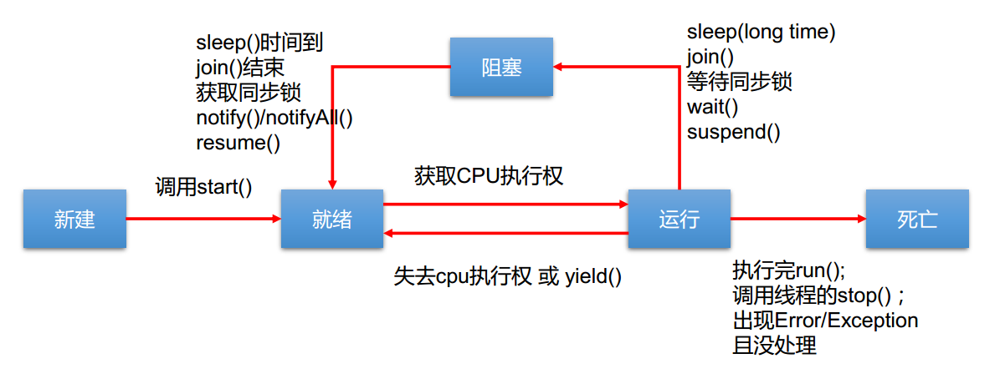

# 7.多线程  
## 7.1 基本概念：程序、进程、线程  
1. 程序(program)是为完成特定任务、用某种语言编写的一组指令的集合。即指一段静态的代码，静态对象。
2. 进程(process)是程序的一次执行过程，或是正在运行的一个程序。是一个动态的过程：有它自身的产生、存在和消亡的过程。 ——生命周期
   - 如：运行中的QQ，运行中的MP3播放器
   - 程序是静态的，进程是动态的
   - 进程作为资源分配的单位， 系统在运行时会为每个进程分配不同的内存区域
3. 线程(thread)，进程可进一步细化为线程，是一个程序内部的一条执行路径。
   - 若一个进程同一时间并行执行多个线程，就是支持多线程的
   - 线程作为调度和执行的单位，每个线程拥有独立的运行栈和程序计数器(pc)，线程切换的开销小
   - 一个进程中的多个线程共享相同的内存单元/内存地址空间它们从同一堆中分配对象，可以访问相同的变量和对象。这就使得线程间通信更简便、高效。但多个线程操作共享的系统资源可能就会带来安全的隐患。
4. 单核CPU和多核CPU的理解
   - 单核CPU，其实是一种假的多线程，因为在一个时间单元内，也只能执行一个线程的任务。
   - 如果是多核的话，才能更好的发挥多线程的效率。
   - 一个Java应用程序java.exe，其实至少有三个线程：main()主线程，gc()垃圾回收线程，异常处理线程。当然如果发生异常，会影响主线程。
5. 并行与并发
   - 并行:多个CPU同时执行多个任务。比如：多个人同时做不同的事。
   - 并发:一个CPU(采用时间片)"同时"执行多个任务。比如：秒杀、多个人做同一件事。
## 7.2 线程的创建和使用
1. 多线程的创建
   - 方式一:继承于Thread类
     - 创建一个继承于Thread类的子类
     - 重写Thread类的run()方法 --> 此线程执行的操作声明在run()方法中
     - 创建Thread类的子类的对象
     - 通过此对象调用start()方法
   - 方式二：实现Runnable接口
     - 创建一个实现了Runnable接口的类
     - 实现类去实现Runnable中的抽象方法:run()
     - 创建实现类的对象
     - 将此对象作为参数传递到Thread类的构造器中，创建Thread类的对象
     - 通过Thread类的对象调用start()
2. Thread类的有关方法
   - start():启动当前线程；调用当前线程的run()
   - run():通常需要重写Thread类中的此方法，将创建的线程要执行的操作声明在此方法中
   - currentThread():静态方法，返回执行当前代码的线程
   - getName:获取当前线程的名字
   - setName:设置当前线程的名字
   - yield():释放当前cpu的执行权
   - join():在线程A中调用线程B的join()，此时线程A就进入阻塞状态，直到线程B完全执行完以后，线程A才结束阻塞状态
   - stop():已过时。当执行此方法时，强制结束当前线程。
   - sleep(long millitime):让当前线程"睡眠"指定的millitime毫秒。在指定的millitime毫秒时间内，当前线程是阻塞状态。
   - isAlive():判断当前线程是否存活
3. 线程的优先级
   - 线程的优先级等级:
     - MAX_PRIORITY:10
     - MIN _PRIORITY:1
     - NORM_PRIORITY:5
   - 如何获取和设置当前线程的优先级:
     - getPriority():返回线程优先值
     - setPriority(int newPriority):改变线程的优先级
   - 说明:
     - 线程创建时继承父线程的优先级
     - 低优先级只是获得调度的概率低，并非一定是在高优先级线程之后才被调用
4. 比较创建线程的两种方式
   - 开发中，优先选择实现Runnable接口的方式
   - 原因:
     - 实现的方式没有类的单继承性的局限性
     - 实现的方式更适合来处理多个线程有共享数据的情况
   - 联系:
     - Thread类也实现了Runnable的接口
     - 两种方式都需要重写run()，将线程要执行的逻辑声明在run()中
## 7.3 线程的生命周期
1. 线程的五种状态
   - 新建:当一个Thread类或其子类的对象被声明并创建时，新生的线程对象处于新建状态
   - 就绪:处于新建状态的线程被start()后，将进入线程队列等待CPU时间片，此时它已具备了运行的条件，只是没分配到CPU资源
   - 运行:当就绪的线程被调度并获得CPU资源时,便进入运行状态，run()方法定义了线程的操作和功能
   - 阻塞:在某种特殊情况下，被人为挂起或执行输入输出操作时，让出CPU并临时中止自己的执行，进入阻塞状态
   - 死亡:线程完成了它的全部工作或线程被提前强制性地中止或出现异常导致结束
2. 线程状态转换图

## 7.4 线程的同步  
1. 方式一:同步代码块
   - 格式:
   ```
     synchronized (同步监视器) {
         //需要被同步的代码块
     }
   ```
   - 说明:
     - 操作共享数据的代码，即为需要被同步的代码
     - 共享数据:多个线程共同操作的变量
     - 同步监视器:俗称，锁。任何一个类的对象，都可以充当锁。多个线程必须要共用同一把锁
     - 在实现Runnable接口创建多线程的方式中，我们可以考虑使用this充当同步监视器
2. 方式二:同步方法
   - 如果操作共享数据的代码完整的声明在一个方法中，我们不妨将此方法声明同步的
   - 同步方法仍然涉及到同步监视器，只是不需要我们显示的声明
   - 非静态的同步方法，同步监视器是:this
   - 静态的同步方法，同步监视器是:当前类本身 
3. 方式三:Lock锁--JDK5.0新增
   - 实例化ReentrantLock
   - 调用锁定方法lock()
   - 调用解锁方法unlock()
4. 优先使用顺序
   - Lock  同步代码块（已经进入了方法体，分配了相应资源）  同步方法（在方法体之外）
5. 同步的方式
   - 好处:解决了线程的安全问题
   - 局限性:操作同步代码时，只能有一个线程参与，其他线程等待，相当于是一个单线程的过程，效率低
6. 线程的死锁问题
   - 死锁的理解:不同的线程分别占用对方需要的同步资源不放弃，都在等待对方放弃自己需要的同步资源，就形成了线程的死锁
   - 说明:
     - 出现死锁后，不会出现异常，不会出现提示，只是所有的线程都处于阻塞状态，无法继续
     - 我们使用同步时，要避免出现死锁
   - 解决方法
     - 专门的算法、原则
     - 尽量减少同步资源的定义
     - 尽量避免嵌套同步
## 7.5 线程的通信  
1. 涉及到的三个方法:
   - wait():一旦执行此方法，当前线程就进入阻塞状态，并释放同步监视器
   - notify():一旦执行此方法，就会唤醒被wait的一个线程。如果有多个线程被wait，就唤醒优先级高的那个。
   - notifyAll():一旦执行此方法，就会唤醒所有被wait的线程。
2. 说明:
   - wait(),notify(),notifyAll()三个方法必须使用在同步代码块或同步方法中。
   - wait(),notify(),notifyAll()三个方法的调用者必须是同步代码块或同步方法中的同步监视器，否则，会出现IllegalMonitorStateException异常
   - wait(),notify(),notifyAll()三个方法是定义在java.lang.Object类中
3. sleep()和wait()的异同？
   - 相同点:一旦执行方法，都可以使得当前的线程进入阻塞状态
   - 不同点:
     - 两个方法声明的位置不同:Thread类中声明sleep(),Object类中声明wait()
     - 调用的要求不同:sleep()可以在任何需要的场景下调用，wait()必须使用在同步代码块或同步方法中
     - 关于是否释放同步监视器:如果两个方法都使用在同步代码块或同步方法中，sleep()不会是否锁，wait()会释放锁
## 7.6 JDK5.0新增线程创建方式  
1. 方式:实现Callable接口
   - 操作步骤:
     - 创建一个实现Callable的实现类
     - 实现call方法，将此线程需要执行的操作声明在call()中
     - 创建Callable接口实现类的对象
     - 将Callable接口实现类的对象作为对象传递到FutureTask构造器中，创建FutureTask的对象
     - 将FutureTask的对象作为参数传递到Thread类的构造器中，创建Thread对象，并调用start()
     - 获取Callable中call方法的返回值
   - 实现Callable接口的方式创建多线程比实现Runnable接口创建多线程方式强大的原因
     - call()可以有返回值的
     - call()可以抛出异常，被外面的操作捕获，获取异常的信息
     - Callable是支持泛型的
2. 方式:使用线程池
   - 背景:
     - 经常创建和销毁、使用量特别大的资源，比如并发情况下的线程，对性能影响很大。
   - 思路:
     - 提前创建好多个线程，放入线程池中，使用时直接获取，使用完放回池中。可以避免频繁创建销毁、实现重复利用。类似生活中的公共交通工具。
   - 好处:
     - 提高响应速度（减少了创建新线程的时间）
     - 降低资源消耗（重复利用线程池中线程，不需要每次都创建）
     - 便于线程管理
       - corePoolSize：核心池的大小
       - maximumPoolSize：最大线程数
       - keepAliveTime：线程没有任务时最多保持多长时间后会终止


