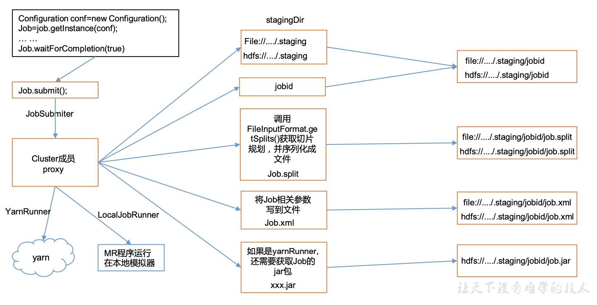
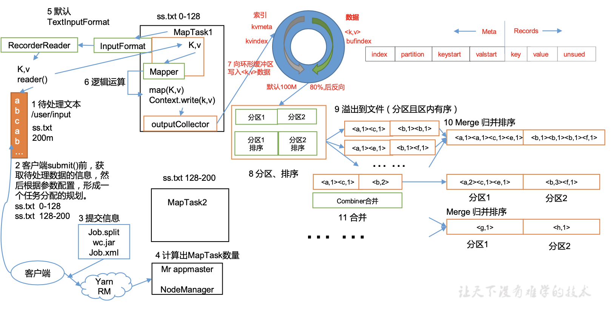
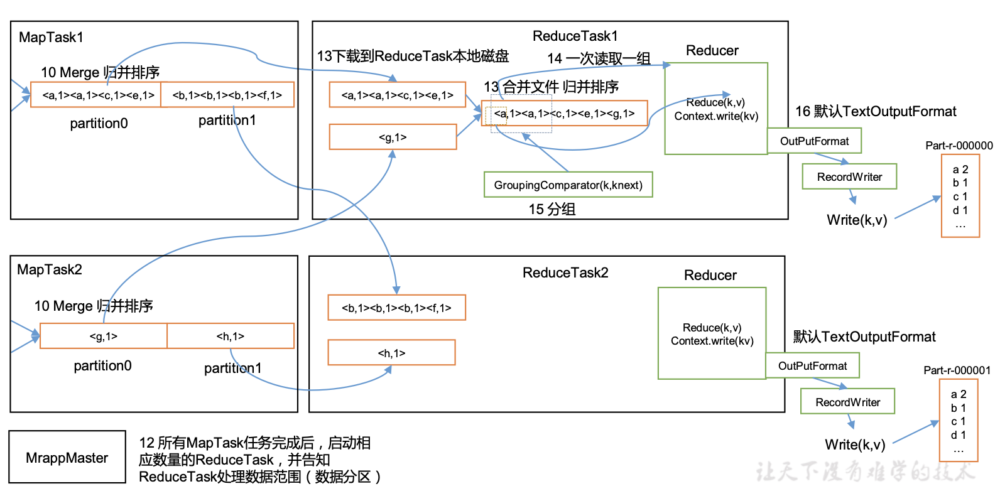
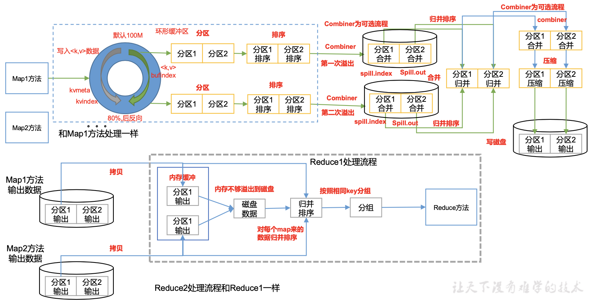
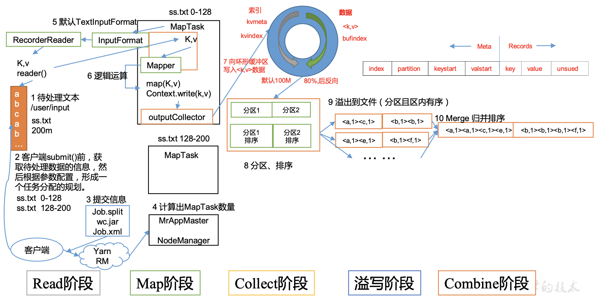
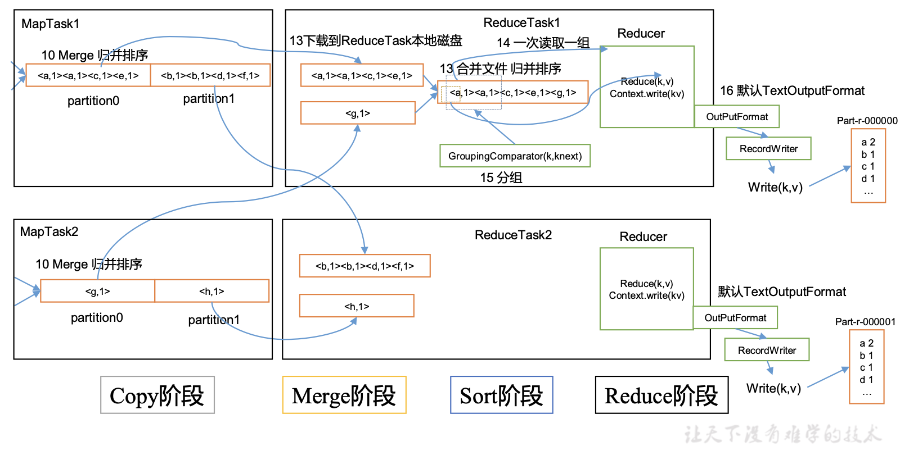

# 14.MapReduce框架原理
## 14.1 InputFormat数据输入
### 14.1.1 切片与MapTask并行度决定机制
1. 一个Job的Map阶段并行度由客户端在提交Job时的切片数决定
2. 每一个Split切片分配一个MapTask并行实例处理
3. 默认情况下，切片大小=BlockSize
4. 切片时不考虑数据集整体，而是逐个针对每一个文件单独切片

### 14.1.2 Job提交流程源码和切片源码详解  
1. Job 提交流程源码详解

2. FileInputFormat切片源码解析(input.getSplits(job))
   - 程序先找到你数据存储的目录。
   - 开始遍历处理(规划切片)目录下的每一个文件。
   - 遍历第一个文件ss.txt
     - 获取文件大小:`fs.sizeOf(ss.txt)`
     - 计算切片大小:`computeSplitSize(Math.max(minSize,Math.min(maxSize,blocksize)))=blocksize=128M`
     - 默认情况下，切片大小=blocksize
     - 开始切，形成第1个切片:ss.txt—0:128M;第2个切片ss.txt—128:256M;第3个切片ss.txt—256M:300M;(每次切片时，都要判断切完剩下的部分是否大于块的1.1倍，不大于1.1倍就划分一块切片)
     - 将切片信息写到一个切片规划文件中
     - 整个切片的核心过程在getSplit()方法中完成
     - InputSplit只记录了切片的元数据信息，比如起始位置、长度以及所在的节点列表等。
   - 提交切片规划文件到YARN上，YARN上的MrAppMaster就可以根据切片规划文件计算开启MapTask个数。

### 14.1.3 FileInputFormat切片机制
1. FileInputFormat切片机制
   - 切片机制
     - 简单地按照文件的内容长度进行切片
     - 切片大小，默认等于Block大小
     - 切片时不考虑数据集整体，而是逐个针对每一个文件单独切片
   - 案例分析
     - 输入数据有两个文件:
        ```
        file1.txt   320M
        file2.txt    10M
        ```
     - 经过FileInputFormat的切片机制运算后，形成的切片信息如下:
        ```
        file1.txt.split1-- 0~128
        file1.txt.split2-- 128~256
        file1.txt.split3-- 256~320
        file2.txt.split1-- 0~10M
        ```
2. FileInputFormat切片大小的参数配置
   - 源码中计算切片大小的公式
    ```
    Math.max(minSize, Math.min(maxSize, blockSize));
    mapreduce.input.fileinputformat.split.minsize= 1 默认值为1
    mapreduce.input.fileinputformat.split.maxsize= Long.MAXValue 默认值Long.MAXValue
    因此，默认情况下，切片大小=blocksize。
    ```
   - 切片大小设置
     - maxsize(切片最大值):参数如果调得比blockSize小，则会让切片变小，而且就等于配置的这个参数的值。
     - minsize(切片最小值):参数调的比blockSize大，则可以让切片变得比blockSize还大。
   - 获取切片信息API
    ```
    // 获取切片的文件名称
    String name = inputSplit.getPath().getName();
    // 根据文件类型获取切片信息
    FileSplit inputSplit = (FileSplit) context.getInputSplit();
    ```

### 14.1.4 CombineTextInputFormat切片机制  
框架默认的TextInputFormat切片机制是对任务按文件规划切片，不管文件多小，都会是一个单独的切片，都会交给一个MapTask，这样如果有大量小文件，就会产生大量的MapTask，处理效率极其低下。
1. 应用场景:  
CombineTextInputFormat用于小文件过多的场景，它可以将多个小文件从逻辑上规划到一个切片中，这样，多个小文件就可以交给一个MapTask处理。
2. 虚拟存储切片最大值设置  
CombineTextInputFormat.setMaxInputSplitSize(job, 4194304);//4m  
注意:虚拟存储切片最大值设置最好根据实际的小文件大小情况来设置具体的值。  
3. 切片机制  
生成切片过程包括:虚拟存储过程和切片过程二部分。  
   - 虚拟存储过程:
     - 将输入目录下所有文件大小，依次和设置的setMaxInputSplitSize值比较，如果不大于设置的最大值，逻辑上划分一个块。如果输入文件大于设置的最大值且大于两倍，那么以最大值切割一块;当剩余数据大小超过设置的最大值且不大于最大值2倍，此时将文件均分成2个虚拟存储块(防止出现太小切片)。
     - 例如setMaxInputSplitSize值为4M，输入文件大小为8.02M，则先逻辑上分成一个4M。剩余的大小为4.02M，如果按照4M逻辑划分，就会出现0.02M的小的虚拟存储文件，所以将剩余的4.02M文件切分成(2.01M和2.01M)两个文件。
   - 切片过程:
     - 判断虚拟存储的文件大小是否大于setMaxInputSplitSize值，大于等于则单独形成一个切片。
     - 如果不大于则跟下一个虚拟存储文件进行合并，共同形成一个切片。
     - 测试举例:有4个小文件大小分别为1.7M、5.1M、3.4M以及6.8M这四个小文件，则虚拟存储之后形成6个文件块，大小分别为:1.7M，(2.55M、2.55M)，3.4M以及(3.4M、3.4M)。最终会形成3个切片，大小分别为:(1.7+2.55)M，(2.55+3.4)M，(3.4+3.4)M。  

### 14.1.5 CombineTextInputFormat案例实操
1. 需求  
将输入的大量小文件合并成一个切片统一处理。  
   - 输入数据:准备4个小文件
   - 期望:期望一个切片处理4个文件
2. 实现过程
   - 不做任何处理，运行WordCount案例程序，观察切片个数为4。
   - 在WordcountDriver中增加如下代码，运行程序，并观察运行的切片个数为3。
    ```
    // 如果不设置InputFormat，它默认用的是TextInputFormat.class
    job.setInputFormatClass(CombineTextInputFormat.class);
    // 虚拟存储切片最大值设置4m
    CombineTextInputFormat.setMaxInputSplitSize(job, 4194304);
    ```
   - 在WordcountDriver中增加如下代码，运行程序，并观察运行的切片个数为1。
    ```
    // 如果不设置 InputFormat，它默认用的是 TextInputFormat.class
    job.setInputFormatClass(CombineTextInputFormat.class);
    // 虚拟存储切片最大值设置20m
    CombineTextInputFormat.setMaxInputSplitSize(job, 20971520);
    ```

### 14.1.6 FileInputFormat实现类
1. TextInputFormat  
TextInputFormat是默认的FileInputFormat实现类。按行读取每条记录。键是存储该行在整个文件中的起始字节偏移量，LongWritable类型。值是这行的内容，不包括任何行终止符(换行符和回车符)， Text类型。  
以下是一个示例，比如，一个分片包含了如下4条文本记录:  
```
Rich learning form
Intelligent learning engine
Learning more convenient
From the real demand for more close to the enterprise
```
每条记录表示为以下键/值对:
```
(0,Rich learning form)
(19,Intelligent learning engine)
(47,Learning more convenient)
(72,From the real demand for more close to the enterprise)
```
2. KeyValueTextInputFormat   
每一行均为一条记录，被分隔符分割为key，value。可以通过在驱动类中设置 `conf.set(KeyValueLineRecordReader.KEY_VALUE_SEPERATOR, "\t")`;来设定分隔符。默认分隔符是`tab(\t)`  
以下是一个示例，输入是一个包含4条记录的分片。其中——>表示一个(水平方向的)制表符。
```
line1 ——>Rich learning form
line2 ——>Intelligent learning engine
line3 ——>Learning more convenient
line4 ——>From the real demand for more close to the enterprise
```
每条记录表示为以下键/值对:  
```
(line1,Rich learning form)
(line2,Intelligent learning engine)
(line3,Learning more convenient)
(line4,From the real demand for more close to the enterprise)
```
3. NLineInputFormat  
如果使用NLineInputFormat，代表每个map进程处理的InputSplit不再按Block块去划分，而是按NLineInputFormat指定的行数N来划分。即输入文件的总行数/N=切片数，如果不整除，切片数=商+1。  
以下是一个示例，仍然以上面的4行输入为例。  
```
Rich learning form
Intelligent learning engine
Learning more convenient
From the real demand for more close to the enterprise
```
例如，如果N是2，则每个输入分片包含两行。开启2个MapTask。  
```
(0,Rich learning form)
(19,Intelligent learning engine)
```
另一个mapper则收到后两行:  
```
(47,Learning more convenient)
(72,From the real demand for more close to the enterprise)
```
这里的键和值与TextInputFormat生成的一样。  

### 14.1.7 KeyValueTextInputFormat使用案例
需求:统计输入文件中每一行的第一个单词相同的行数。  
代码实现:
1. 编写Mapper类  
    ```
    import org.apache.hadoop.io.IntWritable;
    import org.apache.hadoop.io.Text;
    import org.apache.hadoop.mapreduce.Mapper;

    import java.io.IOException;

    public class KVTestMapper extends Mapper<Text, Text, Text, IntWritable> {

        IntWritable v = new IntWritable(1);

        @Override
        protected void map(Text key, Text value, Context context) throws IOException, InterruptedException {
            context.write(key, v);
        }
    }
    ```
2. 编写Reducer类
    ```
    import org.apache.hadoop.io.IntWritable;
    import org.apache.hadoop.io.Text;
    import org.apache.hadoop.mapreduce.Reducer;

    import java.io.IOException;

    public class KVTestReducer extends Reducer<Text, IntWritable, Text, IntWritable> {

        IntWritable v = new IntWritable();

        @Override
        protected void reduce(Text key, Iterable<IntWritable> values, Context context) throws IOException, InterruptedException {
            int sum = 0;
            for (IntWritable value: values) {
                sum += value.get();
            }
            v.set(sum);
            context.write(key, v);
        }
    }
    ```  
3. 编写Driver类
    ```
    import org.apache.hadoop.conf.Configuration;
    import org.apache.hadoop.fs.Path;
    import org.apache.hadoop.io.IntWritable;
    import org.apache.hadoop.io.Text;
    import org.apache.hadoop.mapreduce.Job;
    import org.apache.hadoop.mapreduce.lib.input.FileInputFormat;
    import org.apache.hadoop.mapreduce.lib.input.KeyValueLineRecordReader;
    import org.apache.hadoop.mapreduce.lib.input.KeyValueTextInputFormat;
    import org.apache.hadoop.mapreduce.lib.output.FileOutputFormat;

    import java.io.IOException;

    public class KVTestDriver {
        public static void main(String[] args) throws IOException, ClassNotFoundException, InterruptedException {
            //1. 获取Job对象
            Configuration conf = new Configuration();
            conf.set(KeyValueLineRecordReader.KEY_VALUE_SEPARATOR, " ");
            Job job = Job.getInstance(conf);
            job.setInputFormatClass(KeyValueTextInputFormat.class);
            //2. 设置jar存储对象
            job.setJarByClass(KVTestDriver.class);
            //3. 关联mapper和reducer类
            job.setMapperClass(KVTestMapper.class);
            job.setReducerClass(KVTestReducer.class);
            //4. 设置mapper输出的key和value类型
            job.setMapOutputKeyClass(Text.class);
            job.setMapOutputValueClass(IntWritable.class);
            //5. 设置最终输出的key和value类型
            job.setOutputKeyClass(Text.class);
            job.setOutputValueClass(IntWritable.class);
            //6. 设置输入输出路径
            FileInputFormat.setInputPaths(job, new Path(args[0]));
            FileOutputFormat.setOutputPath(job, new Path(args[1]));
            //7. 提交Job
            boolean completion = job.waitForCompletion(true);
            System.exit(completion ? 0 : 1);
        }
    }
    ```

### 14.1.8 NLineInputFormat使用案例
需求:对每个单词进行个数统计，要求根据每个输入文件的行数来规定输出多少个切片。此案例要求每2行放入一个切片中。  
代码实现:  
1. 编写Mapper类
    ```
    import org.apache.hadoop.io.IntWritable;
    import org.apache.hadoop.io.LongWritable;
    import org.apache.hadoop.io.Text;
    import org.apache.hadoop.mapreduce.Mapper;

    import java.io.IOException;

    public class NLineMapper extends Mapper<LongWritable, Text, Text, IntWritable> {

        Text k = new Text();
        IntWritable v = new IntWritable(1);

        @Override
        protected void map(LongWritable key, Text value, Context context) throws IOException, InterruptedException {
            //1. 获取一行
            String s = value.toString();
            //2. 切割
            String[] words = s.split(" ");

            //3. 循环写出
            for (String word: words) {
                k.set(word);
                context.write(k, v);
            }
        }
    }
    ```
2. 编写Reducer类
    ```
    import org.apache.hadoop.io.IntWritable;
    import org.apache.hadoop.io.Text;
    import org.apache.hadoop.mapreduce.Reducer;

    import java.io.IOException;

    public class NLineReducer extends Reducer<Text, IntWritable, Text, IntWritable> {

        IntWritable v = new IntWritable();

        @Override
        protected void reduce(Text key, Iterable<IntWritable> values, Context context) throws IOException, InterruptedException {
            //1. 累加求和
            int sum = 0;
            for (IntWritable value : values) {
                sum += value.get();
            }
            //2. 写出
            v.set(sum);
            context.write(key, v);
        }
    }
    ```
3. 编写Driver类
    ```
    import org.apache.hadoop.conf.Configuration;
    import org.apache.hadoop.fs.Path;
    import org.apache.hadoop.io.IntWritable;
    import org.apache.hadoop.io.Text;
    import org.apache.hadoop.mapreduce.Job;
    import org.apache.hadoop.mapreduce.lib.input.FileInputFormat;
    import org.apache.hadoop.mapreduce.lib.input.NLineInputFormat;
    import org.apache.hadoop.mapreduce.lib.output.FileOutputFormat;

    import java.io.IOException;

    public class NLineDriver {

        public static void main(String[] args) throws IOException, ClassNotFoundException, InterruptedException {
            // 1 获取job对象
            Configuration configuration = new Configuration();
            Job job = Job.getInstance(configuration);
            // 7 设置每个切片InputSplit中划分三条记录
            NLineInputFormat.setNumLinesPerSplit(job, 2);
            // 8 使用NLineInputFormat处理记录数
            job.setInputFormatClass(NLineInputFormat.class);
            // 2 设置jar包位置，关联mapper和reducer
            job.setJarByClass(NLineDriver.class);
            job.setMapperClass(NLineMapper.class);
            job.setReducerClass(NLineReducer.class);
            // 3 设置map输出kv类型
            job.setMapOutputKeyClass(Text.class);
            job.setMapOutputValueClass(IntWritable.class);
            // 4 设置最终输出kv类型
            job.setOutputKeyClass(Text.class);
            job.setOutputValueClass(IntWritable.class);
            // 5 设置输入输出数据路径
            FileInputFormat.setInputPaths(job, new Path(args[0]));
            FileOutputFormat.setOutputPath(job, new Path(args[1]));
            // 6 提交job
            job.waitForCompletion(true);
        }
    }
    ```

### 14.1.9 自定义InputFormat
在企业开发中，Hadoop框架自带的InputFormat类型不能满足所有应用场景，需要自义InputFormat来解决实际问题。  
自定义InputFormat步骤如下:
1. 自定义一个类继承FileInputFormat。
2. 改写RecordReader，实现一次读取一个完整文件封装为KV。
3. 在输出时使用SequenceFileOutPutFormat输出合并文件。

### 14.1.10 自定义InputFormat案例实操
无论HDFS还是MapReduce，在处理小文件时效率都非常低，但又难免面临处理大量小文件的场景，此时，就需要有相应解决方案。可以自定义InputFormat实现小文件的合并。  
需求:将多个小文件合并成一个SequenceFile文件(SequenceFile文件是Hadoop用来存储二进制形式的key-value对的文件格式)，SequenceFile里面存储着多个文件，存储的形式为文件路径+名称为key，文件内容为value。  
1. 自定义InputFromat
    ```
    import org.apache.hadoop.io.BytesWritable;
    import org.apache.hadoop.io.Text;
    import org.apache.hadoop.mapreduce.InputSplit;
    import org.apache.hadoop.mapreduce.RecordReader;
    import org.apache.hadoop.mapreduce.TaskAttemptContext;
    import org.apache.hadoop.mapreduce.lib.input.FileInputFormat;

    import java.io.IOException;

    public class WholeFileInputformat extends FileInputFormat<Text, BytesWritable> {

        @Override
        public RecordReader<Text, BytesWritable> createRecordReader(InputSplit inputSplit, TaskAttemptContext context) throws IOException, InterruptedException {
            WholeRecordReader recordReader = new WholeRecordReader();
            recordReader.initialize(inputSplit, context);
            return recordReader;
        }
    }
    ```
2. 自定义RecordReader类
    ```
    import org.apache.hadoop.conf.Configuration;
    import org.apache.hadoop.fs.FSDataInputStream;
    import org.apache.hadoop.fs.FileSystem;
    import org.apache.hadoop.fs.Path;
    import org.apache.hadoop.io.BytesWritable;
    import org.apache.hadoop.io.IOUtils;
    import org.apache.hadoop.io.Text;
    import org.apache.hadoop.mapreduce.InputSplit;
    import org.apache.hadoop.mapreduce.RecordReader;
    import org.apache.hadoop.mapreduce.TaskAttemptContext;
    import org.apache.hadoop.mapreduce.lib.input.FileSplit;

    import java.io.IOException;

    public class WholeRecordReader extends RecordReader<Text, BytesWritable> {

        Configuration configuration = new Configuration();
        private FileSplit fileSplit;

        private boolean isProgress = true;
        private BytesWritable value = new BytesWritable();
        private Text k = new Text();

        @Override
        public void initialize(InputSplit inputSplit, TaskAttemptContext context) throws IOException, InterruptedException {
            this.fileSplit = (FileSplit) inputSplit;
            configuration = context.getConfiguration();
        }

        @Override
        public boolean nextKeyValue() throws IOException, InterruptedException {
            if (isProgress) {
                byte[] contents = new byte[(int) fileSplit.getLength()];
                FileSystem fs = null;
                FSDataInputStream fis = null;
                try {
                    Path path = fileSplit.getPath();
                    fs = path.getFileSystem(configuration);
                    fis = fs.open(path);
                    IOUtils.readFully(fis, contents, 0, contents.length);
                    value.set(contents, 0, contents.length);
                    String name = fileSplit.getPath().getName();
                    k.set(name);
                } catch (Exception e) {
                } finally {
                    IOUtils.closeStream(fis);
                }
                isProgress = false;
                return true;
            }
            return false;
        }

        @Override
        public Text getCurrentKey() throws IOException, InterruptedException {
            return k;
        }

        @Override
        public BytesWritable getCurrentValue() throws IOException, InterruptedException {
            return value;
        }

        @Override
        public float getProgress() throws IOException, InterruptedException {
            return 0;
        }

        @Override
        public void close() throws IOException {

        }
    }
    ```
3. 编写SequenceFileMapper类处理流程
    ```
    import org.apache.hadoop.io.ByteWritable;
    import org.apache.hadoop.io.Text;
    import org.apache.hadoop.mapreduce.Mapper;

    import java.io.IOException;

    public class SequenceFileMapper extends Mapper<Text, ByteWritable, Text, ByteWritable> {
        @Override
        protected void map(Text key, ByteWritable value, Context context) throws IOException, InterruptedException {
            context.write(key, value);
        }
    }
    ```
4. 编写SequenceFileReducer类处理流程
    ```
    import org.apache.hadoop.io.BytesWritable;
    import org.apache.hadoop.io.Text;
    import org.apache.hadoop.mapreduce.Reducer;

    import java.io.IOException;

    public class SequenceFileReducer extends Reducer<Text, BytesWritable, Text, BytesWritable> {

        @Override
        protected void reduce(Text key, Iterable<BytesWritable> values, Context context) throws IOException, InterruptedException {
            for (BytesWritable value: values) {
                context.write(key, value);
            }
        }
    }
    ```
5. 编写SequenceFileDriver类处理流程
    ```
    import org.apache.hadoop.conf.Configuration;
    import org.apache.hadoop.fs.Path;
    import org.apache.hadoop.io.ByteWritable;
    import org.apache.hadoop.io.BytesWritable;
    import org.apache.hadoop.io.Text;
    import org.apache.hadoop.mapreduce.Job;
    import org.apache.hadoop.mapreduce.lib.input.FileInputFormat;
    import org.apache.hadoop.mapreduce.lib.output.FileOutputFormat;
    import org.apache.hadoop.mapreduce.lib.output.SequenceFileOutputFormat;

    import java.io.IOException;

    public class SequenceFileDriver {
        public static void main(String[] args) throws IOException, ClassNotFoundException, InterruptedException {
            //1. 获取Job对象
            Configuration configuration = new Configuration();
            Job job = Job.getInstance(configuration);
            //2. 设置jar包存储位置、关联自定义的mapper和reducer
            job.setJarByClass(SequenceFileDriver.class);
            job.setMapperClass(SequenceFileMapper.class);
            job.setReducerClass(SequenceFileReducer.class);
            //7. 设置输入的inputFormat
            job.setInputFormatClass(WholeFileInputformat.class);
            //8. 设置输出的outputFormat
            job.setOutputFormatClass(SequenceFileOutputFormat.class);
            //3. 设置map输出端的kv类型
            job.setMapOutputKeyClass(Text.class);
            job.setMapOutputValueClass(BytesWritable.class);
            //4. 设置最终输出端的kv类型
            job.setOutputKeyClass(Text.class);
            job.setOutputValueClass(ByteWritable.class);
            //5. 设置输入输出路径
            FileInputFormat.setInputPaths(job, new Path(args[0]));
            FileOutputFormat.setOutputPath(job, new Path(args[1]));
            //6. 提交job
            boolean result = job.waitForCompletion(true);
            System.exit(result ? 0 : 1);
        }
    }
    ```

## 14.2 MapReduce工作流程
1. 流程示意图  
  
  
2. 流程详解  
上面的流程是整个MapReduce最全工作流程，但是Shuffle过程只是从第7步开始到第16步结束，具体Shuffle过程详解，如下:  
   - MapTask收集我们的map()方法输出的kv对，放到内存缓冲区中
   - 从内存缓冲区不断溢出本地磁盘文件，可能会溢出多个文件
   - 多个溢出文件会被合并成大的溢出文件
   - 在溢出过程及合并的过程中，都要调用Partitioner进行分区和针对key进行排序
   - ReduceTask根据自己的分区号，去各个MapTask机器上取相应的结果分区数据
   - ReduceTask会取到同一个分区的来自不同MapTask的结果文件，ReduceTask会将这些文件再进行合并(归并排序)
   - 合并成大文件后，Shuffle的过程也就结束了，后面进入ReduceTask的逻辑运算过程(从文件中取出一个一个的键值对Group，调用用户自定义的reduce()方法)
3. 注意  
Shuffle中的缓冲区大小会影响到MapReduce程序的执行效率，原则上说，缓冲区越大，磁盘io的次数越少，执行速度就越快。  
缓冲区的大小可以通过参数调整，参数:io.sort.mb，默认100M。

## 14.3 Shuffle机制
### 14.3.1 Shuffle机制
Map方法之后，Reduce方法之前的数据处理过程称之为Shuffle。  
  

### 14.3.2 Partition分区
1. 问题引出:  
要求将统计结果按照条件输出到不同文件中(分区)。比如:将统计结果按照手机归属地不同省份输出到不同文件中(分区)。
2. 默认Partitioner分区  
```
public class HashPartitioner<K, V> extends Partitioner<K, V> {
    public HashPartitioner() {
    }

    public int getPartition(K key, V value, int numReduceTasks) {
        return (key.hashCode() & 2147483647) % numReduceTasks;
    }
}
```  
默认分区是根据key的hashCode对ReduceTasks个数取模得到的。用户没法控制哪个key存储到哪个分区。  
3. 自定义Partitioner步骤
   - 自定义类继承Partitioner，重写getPartition()方法
    ```
    public class CustomPartitioner extends Partitioner<Text, FlowBean> {
         @Override
         public int getPartition(Text key, FlowBean value, int numPartitions) {
        // 控制分区代码逻辑
        ......
        return partition;
        }
    }
    ```
   - 在Job驱动中，设置自定义Partitioner
    ```
    job.setPartitionerClass(CustomPartitioner.class);
    ```
   - 自定义Partition后，要根据自定义Partitioner的逻辑设置相应数量的ReduceTask
    ```
    job.setNumReduceTasks(5);
    ```
4. 分区总结
   - 如果ReduceTask的数量>getPartition的结果数，则会多产生几个空的输出文件part-r-000xx;
   - 如果1<ReduceTask的数量<getPartition的结果数，则有一部分分区数据无处安放，会Exception;
   - 如果ReduceTask的数量=1，则不管MapTask端输出多少个分区文件，最终结果都交给这一个 ReduceTask，最终也就只会产生一个结果文件part-r-00000;
   - 分区号必须从零开始，逐一累加。
5. 案例分析  
例如:假设自定义分区数为5，则  
   - `job.setNumReduceTasks(1);` 会正常运行，只不过会产生一个输出文件
   - `job.setNumReduceTasks(2);` 会报错
   - `job.setNumReduceTasks(6);` 大于5，程序会正常运行，会产生空文件

### 14.3.3 WritableComparable排序  
排序是MapReduce框架中最重要的操作之一。  
MapTask和ReduceTask均会对数据按照key进行排序。该操作属于Hadoop的默认行为。任何应用程序中的数据均会被排序，而不管逻辑上是否需要。  
默认排序是按照字典顺序排序，且实现该排序的方法是快速排序。  
对于MapTask，它会将处理的结果暂时放到环形缓冲区中，当环形缓冲区使用率达到一定阈值后，再对缓冲区中的数据进行一次快速排序，并将这些有序数据溢写到磁盘上，而当数据处理完毕后，它会对磁盘上所有文件进行归并排序。  
对于ReduceTask，它从每个MapTask上远程拷贝相应的数据文件，如果文件大小超过一定阈值，则溢写磁盘上，否则存储在内存中。如果磁盘上文件数目达到一定阈值，则进行一次归并排序以生成一个更大文件;如果内存中文件大小或者数目超过一定阈值，则进行一次合并后将数据溢写到磁盘上。当所有数据拷贝完毕后，ReduceTask统一对内存和磁盘上的所有数据进行一次归并排序。  
1. 排序的分类
   - 部分排序
     - MapReduce根据输入记录的键对数据集排序。保证输出的每个文件内部有序。
   - 全排序
     - 最终输出结果只有一个文件，且文件内部有序。实现方式是只设置一个ReduceTask。但该方法在处理大型文件时效率极低，因为一台机器处理所有文件，完全丧失了MapReduce所提供的并行架构。
   - 辅助排序:(GroupingComparator分组)
     - 在Reduce端对key进行分组。应用于:在接收的key为bean对象时，想让一个或几个字段相同(全部字段比较不相同)的key进入到同一个reduce方法时，可以采用分组排序。
   - 二次排序
     - 在自定义排序过程中，如果compareTo中的判断条件为两个即为二次排序。
2. 自定义排序WritableComparable  
bean对象做为key传输，需要实现WritableComparable接口重写compareTo方法，就可以实现排序。
    ```
    @Override
    public int compareTo(FlowBean bean) {
        int result;
        // 按照总流量大小，倒序排列
        if (sumFlow > bean.getSumFlow()) {
            result = -1;
        }else if (sumFlow < bean.getSumFlow()) {
            result = 1;
        }else {
            result = 0;
        }
           return result;
    }
    ```

### 14.3.4 WritableComparable排序案例实操(全排序)  
需求:对总流量进行排序(倒序)。  
1. 编写FlowBean对象
    ```
    package sort;

    import org.apache.hadoop.io.WritableComparable;

    import java.io.DataInput;
    import java.io.DataOutput;
    import java.io.IOException;

    public class FlowBean implements WritableComparable<FlowBean> {

        private long upFlow;
        private long downFlow;
        private long sumFlow;

        public FlowBean() {
        }

        public FlowBean(long upFlow, long downFlow) {
            this.upFlow = upFlow;
            this.downFlow = downFlow;
            this.sumFlow = upFlow + downFlow;
        }

        public long getUpFlow() {
            return upFlow;
        }

        public void setUpFlow(long upFlow) {
            this.upFlow = upFlow;
        }

        public long getDownFlow() {
            return downFlow;
        }

        public void setDownFlow(long downFlow) {
            this.downFlow = downFlow;
        }

        public long getSumFlow() {
            return sumFlow;
        }

        public void setSumFlow(long sumFlow) {
            this.sumFlow = sumFlow;
        }

        @Override
        public String toString() {
            return upFlow + "\t" + downFlow + "\t" + sumFlow;
        }

        @Override
        public int compareTo(FlowBean o) {
            int result;
            if (sumFlow > o.getSumFlow()) {
                result = -1;
            } else if (sumFlow < o.getSumFlow()) {
                result = 1;
            } else {
                result = 0;
            }
            return result;
        }

        @Override
        public void write(DataOutput dataOutput) throws IOException {
            dataOutput.writeLong(upFlow);
            dataOutput.writeLong(downFlow);
            dataOutput.writeLong(sumFlow);
        }

        @Override
        public void readFields(DataInput dataInput) throws IOException {
            upFlow = dataInput.readLong();
            downFlow = dataInput.readLong();
            sumFlow = dataInput.readLong();
        }
    }
    ```
2. 编写Mapper类
    ```
    package sort;

    import org.apache.hadoop.io.LongWritable;
    import org.apache.hadoop.io.Text;
    import org.apache.hadoop.mapreduce.Mapper;

    import java.io.IOException;

    public class FlowCountSortMapper extends Mapper<LongWritable, Text, FlowBean, Text> {

        FlowBean k = new FlowBean();
        Text v = new Text();
        @Override
        protected void map(LongWritable key, Text value, Context context) throws IOException, InterruptedException {
            //1. 获取1行
            String text = value.toString();
            //2. 切分
            String[] fileds = text.split("\t");
            //3. 封装对象
            v.set(fileds[0]);
            k.setUpFlow(Long.parseLong(fileds[1]));
            k.setDownFlow(Long.parseLong(fileds[2]));
            k.setSumFlow(Long.parseLong(fileds[3]));
            //4. 写出
            context.write(k, v);
        }
    }
    ```
3. 编写Reducer类
    ```
    package sort;

    import org.apache.hadoop.io.Text;
    import org.apache.hadoop.mapreduce.Reducer;

    import java.io.IOException;

    public class FlowCountSortReducer extends Reducer<FlowBean, Text, Text, FlowBean> {

        @Override
        protected void reduce(FlowBean key, Iterable<Text> values, Context context) throws IOException, InterruptedException {
            for (Text value : values) {
                context.write(value, key);
            }
        }
    }
    ```
4. 编写Driver类
    ```
    package sort;

    import org.apache.hadoop.conf.Configuration;
    import org.apache.hadoop.fs.Path;
    import org.apache.hadoop.io.Text;
    import org.apache.hadoop.mapreduce.Job;
    import org.apache.hadoop.mapreduce.lib.input.FileInputFormat;
    import org.apache.hadoop.mapreduce.lib.output.FileOutputFormat;

    import java.io.IOException;

    public class FlowCountSortDriver {

        public static void main(String[] args) throws IOException, ClassNotFoundException, InterruptedException {
            //1. 获取Job对象实例
            Configuration conf = new Configuration();
            Job job = Job.getInstance(conf);
            //2. 关联Driver类
            job.setJarByClass(FlowCountSortDriver.class);
            //3. 关联Mapper类和Reducer类
            job.setMapperClass(FlowCountSortMapper.class);
            job.setReducerClass(FlowCountSortReducer.class);
            //4. 指定Mapper输出数据的kv类型
            job.setMapOutputKeyClass(FlowBean.class);
            job.setMapOutputValueClass(Text.class);
            //5. 指定最终输出数据的kv类型
            job.setOutputKeyClass(Text.class);
            job.setOutputValueClass(FlowBean.class);
            //6. 指定文件输入输出的路径
            FileInputFormat.setInputPaths(job, new Path(args[0]));
            FileOutputFormat.setOutputPath(job, new Path(args[1]));
            //7. 提交运行
            boolean result = job.waitForCompletion(true);
            System.exit(result ? 0 : 1);
        }
    }
    ```

### 14.3.5 WritableComparable排序案例实操(区内排序)  
需求:要求每个省份手机号输出的文件中按照总流量内部排序。  
1. 增加自定义分区类  
    ```
    package sort;

    import org.apache.hadoop.io.Text;
    import org.apache.hadoop.mapreduce.Partitioner;

    public class ProvincePartitioner extends Partitioner<FlowBean, Text> {

        @Override
        public int getPartition(FlowBean flowBean, Text text, int i) {
            int partition = 4;
            String preNum = text.toString().substring(0,3);
            if ("136".equals(preNum)) {
                partition = 0;
            } else if ("137".equals(preNum)) {
                partition = 1;
            } else if ("138".equals(preNum)) {
                partition = 2;
            } else if ("139".equals(preNum)) {
                partition = 3;
            }
            return partition;
        }
    }
    ```
2. 在驱动类中添加分区类  
    ```
    //加载自定义分区类
    job.setPartitionerClass(ProvincePartitioner.class);
    //设置Reducetask个数
    job.setNumReduceTasks(5);
    ```

### 14.3.6 Combiner合并
1. Combiner是MR程序中Mapper和Reducer之外的一种组件。
2. Combiner组件的父类就是Reducer。
3. Combiner和Reducer的区别在于运行的位置
   - Combiner是在每一个MapTask所在的节点运行;
   - Reducer是接收全局所有Mapper的输出结果;
4. Combiner的意义就是对每一个MapTask的输出进行局部汇总，以减小网络传输量。
5. Combiner能够应用的前提是不能影响最终的业务逻辑，而且，Combiner的输出kv应该跟Reducer的输入kv类型要对应起来
6. 自定义Combiner实现步骤
   - 自定义一个Combiner继承Reducer，重写Reduce方法
    ```
    public class WordcountCombiner extends Reducer<Text, IntWritable, Text,IntWritable>{
        @Override
        protected void reduce(Text key, Iterable<IntWritable> values,Context context) throws IOException, InterruptedException {
        // 1 汇总操作
        int count = 0;
        for(IntWritable v :values){
            count += v.get();
        }
        // 2 写出
        context.write(key, new IntWritable(count));
        }
    }
    ```
   - 在 Job 驱动类中设置:`job.setCombinerClass(WordcountCombiner.class);`

### 14.3.7 Combiner合并案例实操
需求:统计过程中对每一个MapTask的输出进行局部汇总，以减小网络传输量即采用Combiner功能。  
方案一:  
1. 增加一个WordCountCombiner类继承Reducer
    ```
    package wordcount;

    import org.apache.hadoop.io.IntWritable;
    import org.apache.hadoop.io.Text;
    import org.apache.hadoop.mapreduce.Reducer;

    import java.io.IOException;

    public class WordcountCombiner extends Reducer<Text, IntWritable, Text, IntWritable> {
        IntWritable v = new IntWritable();

        @Override
        protected void reduce(Text key, Iterable<IntWritable> values, Context context) throws IOException, InterruptedException {
            int sum = 0;
            for (IntWritable value: values) {
                sum += value.get();
            }
            v.set(sum);
            context.write(key, v);
        }
    }
    ```
2. 在WordCountDriver驱动类中指定Combiner
    ```
    // 指定需要使用combiner，以及用哪个类作为combiner的逻辑
    job.setCombinerClass(WordcountCombiner.class);
    ```

方案二:  
1. 将WordcountReducer作为Combiner在WordcountDriver驱动类中指定
    ```
    // 指定需要使用Combiner，以及用哪个类作为Combiner的逻辑
    job.setCombinerClass(WordcountReducer.class);
    ```

### 14.3.8 GroupingComparator分组(辅助排序)
对Reduce阶段的数据根据某一个或几个字段进行分组。  
分组排序步骤:  
1. 自定义类继承WritableComparator
2. 重写compare()方法
    ```
    @Override
    public int compare(WritableComparable a, WritableComparable b) {
    }
    ```
3. 创建一个构造将比较对象的类传给父类

### 14.3.9 GroupingComparator分组案例实操
需求:  
有如下订单数据  

| 订单 id | 商品 id | 成交金额 |
|: :|: :|: :|
| 0000001 | Pdt_01 | 222.8 |
| 0000001 | Pdt_02 | 33.8 |
| 0000002 | Pdt_03 | 522.8 |
| 0000002 | Pdt_04 | 122.4 |
| 0000002 | Pdt_05 | 722.4 |
| 0000003 | Pdt_06 | 232.8 |
| 0000003 | Pdt_02 | 33.8 |

现在需要求出每一个订单中最贵的商品。

1. 定义订单信息OrderBean类
    ```
    package order;

    import org.apache.hadoop.io.WritableComparable;

    import java.io.DataInput;
    import java.io.DataOutput;
    import java.io.IOException;

    public class OrderBean implements WritableComparable<OrderBean> {

        private int order_id;
        private double price;

        public OrderBean() {
        }

        public OrderBean(int order_id, double price) {
            this.order_id = order_id;
            this.price = price;
        }

        public int getOrder_id() {
            return order_id;
        }

        public void setOrder_id(int order_id) {
            this.order_id = order_id;
        }

        public double getPrice() {
            return price;
        }

        public void setPrice(double price) {
            this.price = price;
        }

        @Override
        public String toString() {
            return order_id + "\t" + price;
        }

        @Override
        public int compareTo(OrderBean orderBean) {
            int result = 0;
            if (order_id > orderBean.order_id) {
                result = 1;
            } else if (order_id < orderBean.order_id) {
                result = -1;
            } else {
                if (price > orderBean.price) {
                    result = -1;
                } else if (price < orderBean.price) {
                    result = 1;
                }
            }
            return result;
        }

        @Override
        public void write(DataOutput dataOutput) throws IOException {
            dataOutput.writeInt(order_id);
            dataOutput.writeDouble(price);
        }

        @Override
        public void readFields(DataInput dataInput) throws IOException {
            order_id = dataInput.readInt();
            price = dataInput.readDouble();
        }
    }
    ```
2. 编写OrderSortMapper类
    ```
    package order;

    import org.apache.hadoop.io.LongWritable;
    import org.apache.hadoop.io.NullWritable;
    import org.apache.hadoop.io.Text;
    import org.apache.hadoop.mapreduce.Mapper;

    import java.io.IOException;

    public class OrderSortMapper extends Mapper<LongWritable, Text, OrderBean, NullWritable> {
        OrderBean k = new OrderBean();
        @Override
        protected void map(LongWritable key, Text value, Context context) throws IOException, InterruptedException {
            //1. 获取一行
            String line = value.toString();
            //2. 截取
            String[] fields = line.split("\t");
            //3. 封装对象
            k.setOrder_id(Integer.parseInt(fields[0]));
            k.setPrice(Double.parseDouble(fields[2]));
            //4. 写出
            context.write(k, NullWritable.get());
        }
    }
    ```
3. 编写OrderSortGroupingComparator类
    ```
    package order;

    import org.apache.hadoop.io.WritableComparator;

    public class OrderSortGroupingComparator extends WritableComparator {

        protected OrderSortGroupingComparator() {
            super(OrderBean.class, true);
        }

        @Override
        public int compare(Object a, Object b) {
            int result = 0;
            OrderBean aBean = (OrderBean) a;
            OrderBean bBean = (OrderBean) b;
            if (aBean.getOrder_id() > bBean.getOrder_id()) {
                result = 1;
            } else if (aBean.getOrder_id() < bBean.getOrder_id()) {
                result = -1;
            }
            return result;
        }
    }
    ```
4. 编写OrderSortReducer类
    ```
    package order;

    import org.apache.hadoop.io.NullWritable;
    import org.apache.hadoop.mapreduce.Reducer;

    import java.io.IOException;

    public class OrderSortReducer extends Reducer<OrderBean, NullWritable, OrderBean, NullWritable> {

        @Override
        protected void reduce(OrderBean key, Iterable<NullWritable> values, Context context) throws IOException, InterruptedException {
            context.write(key, NullWritable.get());
        }
    }
    ```
5. 编写OrderSortDriver类
    ```
    package order;

    import org.apache.hadoop.conf.Configuration;
    import org.apache.hadoop.fs.Path;
    import org.apache.hadoop.io.NullWritable;
    import org.apache.hadoop.mapreduce.Job;
    import org.apache.hadoop.mapreduce.lib.input.FileInputFormat;
    import org.apache.hadoop.mapreduce.lib.output.FileOutputFormat;

    import java.io.IOException;

    public class OrderSortDriver {
        public static void main(String[] args) throws IOException, ClassNotFoundException, InterruptedException {
            //1. 生成job实例
            Configuration conf = new Configuration();
            Job job = Job.getInstance(conf);
            //2. 设置jar包加载路径
            job.setJarByClass(OrderSortDriver.class);
            //3. 加载map/reduce类
            job.setMapperClass(OrderSortMapper.class);
            job.setReducerClass(OrderSortReducer.class);
            //4. 设置map输出数据key和value类型
            job.setMapOutputKeyClass(OrderBean.class);
            job.setMapOutputValueClass(NullWritable.class);
            //5. 设置最终输出数据的key和value类型
            job.setOutputKeyClass(OrderBean.class);
            job.setOutputValueClass(NullWritable.class);
            //6. 设置输入数据和输出数据路径
            FileInputFormat.setInputPaths(job, new Path(args[0]));
            FileOutputFormat.setOutputPath(job, new Path(args[1]));
            //7. 设置reduce端的分组
            job.setGroupingComparatorClass(OrderSortGroupingComparator.class);
            //8. 提交任务
            boolean result = job.waitForCompletion(true);
            System.exit(result ? 0 : 1);
        }
    }
    ```

## 14.4 MapTask工作机制  
  

1. Read阶段:MapTask通过用户编写的RecordReader，从输入InputSplit中解析出一个个 key/value。
2. Map阶段:该节点主要是将解析出的key/value交给用户编写map()函数处理，并产生一系列新的key/value。
3. Collect收集阶段:在用户编写map()函数中，当数据处理完成后，一般会调用 OutputCollector.collect()输出结果。在该函数内部，它会将生成的key/value分区(调用 Partitioner)，并写入一个环形内存缓冲区中。
4. Spill阶段:即“溢写”，当环形缓冲区满后，MapReduce会将数据写到本地磁盘上，生成一个临时文件。需要注意的是，将数据写入本地磁盘之前，先要对数据进行一次本地排序，并在必要时对数据进行合并、压缩等操作。
   - 步骤1:利用快速排序算法对缓存区内的数据进行排序，排序方式是，先按照分区编号 Partition进行排序，然后按照key进行排序。这样，经过排序后，数据以分区为单位聚集在一起，且同一分区内所有数据按照key有序。
   - 步骤2:按照分区编号由小到大依次将每个分区中的数据写入任务工作目录下的临时文件 output/spillN.out(N表示当前溢写次数)中。如果用户设置了Combiner，则写入文件之前，对每个分区中的数据进行一次聚集操作。
   - 步骤3:将分区数据的元信息写到内存索引数据结构SpillRecord中，其中每个分区的元信息包括在临时文件中的偏移量、压缩前数据大小和压缩后数据大小。如果当前内存索引大小超过1MB，则将内存索引写到文件output/spillN.out.index中。
5. Combine阶段:当所有数据处理完成后，MapTask对所有临时文件进行一次合并，以确保最终只会生成一个数据文件。  
当所有数据处理完后，MapTask会将所有临时文件合并成一个大文件，并保存到文件output/file.out中，同时生成相应的索引文件output/file.out.index。  
在进行文件合并过程中，MapTask以分区为单位进行合并。对于某个分区，它将采用多轮递归合并的方式。每轮合并io.sort.factor(默认 10)个文件，并将产生的文件重新加入待合并列表中，对文件排序后，重复以上过程，直到最终得到一个大文件。  
让每个 MapTask 最终只生成一个数据文件，可避免同时打开大量文件和同时读取大量小文件产生的随机读取带来的开销。

## 14.5 ReduceTask工作机制  
1. ReduceTask工作机制
  

   - Copy阶段:ReduceTask从各个MapTask上远程拷贝一片数据，并针对某一片数据，如果其大小超过一定阈值，则写到磁盘上，否则直接放到内存中。
   - Merge阶段:在远程拷贝数据的同时，ReduceTask启动了两个后台线程对内存和磁盘上的文件进行合并，以防止内存使用过多或磁盘上文件过多。
   - Sort阶段:按照MapReduce语义，用户编写reduce()函数输入数据是按key进行聚集的一组数据。为了将key相同的数据聚在一起，Hadoop采用了基于排序的策略。由于各个MapTask已经实现对自己的处理结果进行了局部排序，因此，ReduceTask只需对所有数据进行一次归并排序即可。
   - Reduce阶段:reduce()函数将计算结果写到HDFS上
2. 设置ReduceTask并行度(个数)  
ReduceTask的并行度同样影响整个Job的执行并发度和执行效率，但与MapTask的并发数由切片数决定不同，ReduceTask数量的决定是可以直接手动设置:
    ```
     // 默认值是 1，手动设置为 4
     job.setNumReduceTasks(4);
    ```
3. 注意事项
   - ReduceTask=0，表示没有Reduce阶段，输出文件个数和Map个数一致。
   - ReduceTask默认值就是1，所以输出文件个数为一个。
   - 如果数据分布不均匀，就有可能在Reduce阶段产生数据倾斜。
   - ReduceTask数量并不是任意设置，还要考虑业务逻辑需求，有些情况下，需要计算全局汇总结果，就只能有1个ReduceTask。
   - 具体多少个ReduceTask，需要根据集群性能而定。
   - 如果分区数不是1，但是ReduceTask为1，是否执行分区过程。答案是:不执行分区过程。因为在MapTask的源码中，执行分区的前提是先判断ReduceNum个数是否大于1。不大于1肯定不执行。

## 14.6 OutputFormat数据输出  
### 14.6.1 OutputFormat接口实现类  
OutputFormat是MapReduce输出的基类，所有实现MapReduce输出都实现了OutputFormat接口。下面我们介绍几种常见的OutputFormat实现类。  
1. 文本输出TextOutputFormat  
默认的输出格式是TextOutputFormat，它把每条记录写为文本行。它的键和值可以是任意类型，因为TextOutputFormat调用toString()方法把它们转换为字符串。  
2. SequenceFileOutputFormat  
将SequenceFileOutputFormat输出作为后续MapReduce任务的输入，这便是一种好的输出格式，因为它的格式紧凑，很容易被压缩。  
3. 自定义OutputFormat  
根据用户需求，自定义实现输出。  

### 14.6.2 自定义OutputFormat  
1. 使用场景  
为了实现控制最终文件的输出路径和输出格式，可以自定义OutputFormat。  
例如:要在一个MapReduce程序中根据数据的不同输出两类结果到不同目录，这类灵活的输出需求可以通过自定义OutputFormat来实现。  
2. 自定义OutputFormat步骤  
   - 自定义一个类继承FileOutputFormat。
   - 改写RecordWriter，具体改写输出数据的方法write()。

### 14.6.3 自定义OutputFormat案例实操  
需求:过滤输入的log日志，包含atguigu的网站输出到e:/atguigu.log，不包含atguigu的网站 输出到e:/other.log。  
1. 编写FilterMapper类  
    ```
    package outputformat;

    import org.apache.hadoop.io.LongWritable;
    import org.apache.hadoop.io.NullWritable;
    import org.apache.hadoop.io.Text;
    import org.apache.hadoop.mapreduce.Mapper;

    import java.io.IOException;

    public class FilterMapper extends Mapper<LongWritable, Text, Text, NullWritable> {
        @Override
        protected void map(LongWritable key, Text value, Context context) throws IOException, InterruptedException {
            context.write(value, NullWritable.get());
        }
    }
    ```
2. 编写FilterReducer类  
    ```
    package outputformat;

    import org.apache.hadoop.io.NullWritable;
    import org.apache.hadoop.io.Text;
    import org.apache.hadoop.mapreduce.Reducer;

    import java.io.IOException;

    public class FilterReducer extends Reducer<Text, NullWritable, Text, NullWritable> {
        Text k = new Text();
        @Override
        protected void reduce(Text key, Iterable<NullWritable> values, Context context) throws IOException, InterruptedException {
            String line = key.toString();
            line += "\r\n";
            k.set(line);
            for (NullWritable value: values) {
                context.write(k, NullWritable.get());
            }
        }
    }
    ```
3. 编写FilterOutputFormat类  
    ```
    package outputformat;

    import org.apache.hadoop.io.NullWritable;
    import org.apache.hadoop.io.Text;
    import org.apache.hadoop.mapreduce.RecordWriter;
    import org.apache.hadoop.mapreduce.TaskAttemptContext;
    import org.apache.hadoop.mapreduce.lib.output.FileOutputFormat;

    import java.io.IOException;

    public class FilterOutputFormat extends FileOutputFormat<Text, NullWritable> {
        @Override
        public RecordWriter<Text, NullWritable> getRecordWriter(TaskAttemptContext taskAttemptContext) throws IOException, InterruptedException {
            return new FilterRecordWriter(taskAttemptContext);
        }
    }
    ```
4. 编写RecordWriter类  
    ```
    package outputformat;

    import org.apache.hadoop.fs.FSDataOutputStream;
    import org.apache.hadoop.fs.FileSystem;
    import org.apache.hadoop.fs.Path;
    import org.apache.hadoop.io.IOUtils;
    import org.apache.hadoop.io.NullWritable;
    import org.apache.hadoop.io.Text;
    import org.apache.hadoop.mapreduce.RecordWriter;
    import org.apache.hadoop.mapreduce.TaskAttemptContext;

    import java.io.IOException;

    public class FilterRecordWriter extends RecordWriter<Text, NullWritable> {

        FSDataOutputStream atguiguOut = null;
        FSDataOutputStream otherOut = null;

        public FilterRecordWriter(TaskAttemptContext taskAttemptContext) {
            try {
                FileSystem fs = FileSystem.get(taskAttemptContext.getConfiguration());
                atguiguOut = fs.create(new Path("/tmp/atguigu.log"));
                otherOut = fs.create(new Path("/tmp/other.log"));
            } catch (IOException e) {
                e.printStackTrace();
            }

        }

        @Override
        public void write(Text text, NullWritable nullWritable) throws IOException, InterruptedException {
           if (text.toString().contains("atguigu")) {
               atguiguOut.write(text.toString().getBytes());
           } else {
               otherOut.write(text.toString().getBytes());
           }
        }

        @Override
        public void close(TaskAttemptContext taskAttemptContext) throws IOException, InterruptedException {
            IOUtils.closeStream(atguiguOut);
            IOUtils.closeStream(otherOut);
        }
    }
    ```
5. 编写FilterDriver类  
    ```
    package outputformat;

    import org.apache.hadoop.conf.Configuration;
    import org.apache.hadoop.fs.Path;
    import org.apache.hadoop.io.NullWritable;
    import org.apache.hadoop.io.Text;
    import org.apache.hadoop.mapreduce.Job;
    import org.apache.hadoop.mapreduce.lib.input.FileInputFormat;
    import org.apache.hadoop.mapreduce.lib.output.FileOutputFormat;

    import java.io.IOException;

    public class FilterDriver {
        public static void main(String[] args) throws IOException, ClassNotFoundException, InterruptedException {
            Configuration conf = new Configuration();
            Job job = Job.getInstance(conf);

            job.setJarByClass(FilterDriver.class);
            job.setMapperClass(FilterMapper.class);
            job.setReducerClass(FilterReducer.class);

            job.setMapOutputKeyClass(Text.class);
            job.setMapOutputValueClass(NullWritable.class);

            job.setOutputKeyClass(Text.class);
            job.setOutputValueClass(NullWritable.class);

            job.setOutputFormatClass(FilterOutputFormat.class);

            FileInputFormat.setInputPaths(job, new Path(args[0]));
            // 虽然我们自定义了outputformat，但是因为我们的outputformat继承自fileoutputformat
            // 而fileoutputformat要输出一个_SUCCESS文件，所以，在这还得指定一个输出目录
            FileOutputFormat.setOutputPath(job, new Path(args[1]));

            boolean result = job.waitForCompletion(true);
            System.exit(result ? 0 : 1);
        }
    }
    ```

## 14.7 Join多种应用  
### 14.7.1 Reduce Join  
Map端的主要工作:为来自不同表或文件的key/value对，打标签以区别不同来源的记录。然后用连接字段作为key，其余部分和新加的标志作为value，最后进行输出。  
Reduce端的主要工作:在Reduce端以连接字段作为key的分组已经完成，我们只需要在每一个分组当中将那些来源于不同文件的记录(在Map阶段已经打标志)分开，最后进行合并就ok了。  

### 14.7.2 Reduce Join案例实操  
需求:  

| id | pid | amount |
| :-- : | :-- : | :-- : |
| 1001 | 01 | 1 |
| 1002 | 02 | 2 |
| 1003 | 03 | 3 |
| 1004 | 01 | 4 |
| 1005 | 02 | 5 |
| 1006 | 03 | 6 |

| pid | pname |
| :-- : | :-- : |
| 01 | 小米 |
| 02 | 华为 |
| 03 | 格力 |

将商品信息表中数据根据商品pid合并到订单数据表中

| id | pname | amount |
| :-- : | :-- : | :-- : |
| 1001 | 小米 | 1 |
| 1004 | 小米 | 4 |
| 1002 | 华为 | 2 |
| 1005 | 华为 | 5 |
| 1003 | 格力 | 3 |
| 1006 | 格力 | 6 |

1. 创建商品和订合并后的Bean类
    ```
    package table;

    import org.apache.hadoop.io.Writable;

    import java.io.DataInput;
    import java.io.DataOutput;
    import java.io.IOException;

    public class TableBean implements Writable {

        private String id;
        private String pid;
        private int amount;
        private String pname;
        private String flag;

        public TableBean() {
        }

        public TableBean(String id, String pid, int amount, String pname, String flag) {
            this.id = id;
            this.pid = pid;
            this.amount = amount;
            this.pname = pname;
            this.flag = flag;
        }

        @Override
        public void write(DataOutput dataOutput) throws IOException {
            dataOutput.writeUTF(id);
            dataOutput.writeUTF(pid);
            dataOutput.writeInt(amount);
            dataOutput.writeUTF(pname);
            dataOutput.writeUTF(flag);
        }

        @Override
        public void readFields(DataInput dataInput) throws IOException {
            id = dataInput.readUTF();
            pid = dataInput.readUTF();
            amount = dataInput.readInt();
            pname = dataInput.readUTF();
            flag = dataInput.readUTF();
        }

        public String getId() {
            return id;
        }

        public void setId(String id) {
            this.id = id;
        }

        public String getPid() {
            return pid;
        }

        public void setPid(String pid) {
            this.pid = pid;
        }

        public int getAmount() {
            return amount;
        }

        public void setAmount(int amount) {
            this.amount = amount;
        }

        public String getPname() {
            return pname;
        }

        public void setPname(String pname) {
            this.pname = pname;
        }

        public String getFlag() {
            return flag;
        }

        public void setFlag(String flag) {
            this.flag = flag;
        }

        @Override
        public String toString() {
            return id + "\t" + amount + "\t" + pname;
        }
    }
    ```
2. 编写TableMapper类
    ```
    package table;

    import org.apache.hadoop.io.LongWritable;
    import org.apache.hadoop.io.Text;
    import org.apache.hadoop.mapreduce.Mapper;
    import org.apache.hadoop.mapreduce.lib.input.FileSplit;

    import java.io.IOException;

    public class TableMapper extends Mapper<LongWritable, Text, Text, TableBean> {

        String name;
        Text k = new Text();
        TableBean tableBean = new TableBean();

        @Override
        protected void setup(Context context) throws IOException, InterruptedException {
            FileSplit inputSplit = (FileSplit) context.getInputSplit();
            name = inputSplit.getPath().getName();
        }

        @Override
        protected void map(LongWritable key, Text value, Context context) throws IOException, InterruptedException {
            String line = value.toString();
            if (name.startsWith("order")) {
                String[] fields = line.split("\t");
                tableBean.setId(fields[0]);
                tableBean.setPid(fields[1]);
                tableBean.setAmount(Integer.parseInt(fields[2]));
                tableBean.setPname("");
                tableBean.setFlag("order");
                k.set(fields[1]);
            } else {
                String[] fields = line.split("\t");
                tableBean.setId("");
                tableBean.setPid(fields[0]);
                tableBean.setAmount(0);
                tableBean.setPname(fields[1]);
                tableBean.setFlag("pd");
                k.set(fields[0]);
            }
            context.write(k, tableBean);
        }
    }
    ```
3. 编写TableReducer类
    ```
    package table;

    import org.apache.commons.beanutils.BeanUtils;
    import org.apache.hadoop.io.NullWritable;
    import org.apache.hadoop.io.Text;
    import org.apache.hadoop.mapreduce.Reducer;

    import java.io.IOException;
    import java.lang.reflect.InvocationTargetException;
    import java.util.ArrayList;

    public class TableReducer extends Reducer<Text, TableBean, TableBean, NullWritable> {
        @Override
        protected void reduce(Text key, Iterable<TableBean> values, Context context) throws IOException, InterruptedException {
            ArrayList<TableBean> tableBeanArrayList = new ArrayList<>();
            TableBean pdBean = new TableBean();

            for (TableBean tableBean : values) {
                if ("order".equals(tableBean.getFlag())) {
                    TableBean tableBeanTemp = new TableBean();
                    try {
                        BeanUtils.copyProperties(tableBeanTemp, tableBean);
                    } catch (IllegalAccessException e) {
                        e.printStackTrace();
                    } catch (InvocationTargetException e) {
                        e.printStackTrace();
                    }
                    tableBeanArrayList.add(tableBeanTemp);
                } else {
                    try {
                        BeanUtils.copyProperties(pdBean, tableBean);
                    } catch (IllegalAccessException e) {
                        e.printStackTrace();
                    } catch (InvocationTargetException e) {
                        e.printStackTrace();
                    }
                }
            }

            for (TableBean tableBean : tableBeanArrayList) {
                tableBean.setPname(pdBean.getPname());
                context.write(tableBean, NullWritable.get());
            }
        }
    }
    ```
4. 编写TableDriver类
    ```
    package table;

    import org.apache.hadoop.conf.Configuration;
    import org.apache.hadoop.fs.Path;
    import org.apache.hadoop.io.NullWritable;
    import org.apache.hadoop.io.Text;
    import org.apache.hadoop.mapreduce.Job;
    import org.apache.hadoop.mapreduce.lib.input.FileInputFormat;
    import org.apache.hadoop.mapreduce.lib.output.FileOutputFormat;

    import java.io.IOException;

    public class TableDriver {
        public static void main(String[] args) throws IOException, ClassNotFoundException, InterruptedException {
            Configuration conf = new Configuration();
            Job job = Job.getInstance(conf);

            job.setJarByClass(TableDriver.class);
            job.setMapperClass(TableMapper.class);
            job.setReducerClass(TableReducer.class);

            job.setMapOutputKeyClass(Text.class);
            job.setMapOutputValueClass(TableBean.class);
            job.setOutputKeyClass(TableBean.class);
            job.setOutputValueClass(NullWritable.class);

            FileInputFormat.setInputPaths(job, new Path(args[0]));
            FileOutputFormat.setOutputPath(job, new Path(args[1]));

            boolean result = job.waitForCompletion(true);
            System.exit(result ? 0 : 1);
        }
    }
    ```
5. 总结  
缺点:这种方式中，合并的操作是在Reduce阶段完成，Reduce端的处理压力太大，Map节点的运算负载则很低，资源利用率不高，且在Reduce阶段极易产生数据倾斜。  

### 14.7.3 Map Join  
1. 使用场景  
Map Join适用于一张表十分小、一张表很大的场景。  
2. 优点  
在Map端缓存多张表，提前处理业务逻辑，这样增加Map端业务，减少Reduce端数据的压力，尽可能的减少数据倾斜。  
3. 具体办法:采用DistributedCache  
   - 在Mapper的setup阶段，将文件读取到缓存集合中。  
   - 在驱动函数中加载缓存。  

### 14.7.4 Map Join案例实操  
需求:  

| id | pid | amount |
| :-- : | :-- : | :-- : |
| 1001 | 01 | 1 |
| 1002 | 02 | 2 |
| 1003 | 03 | 3 |
| 1004 | 01 | 4 |
| 1005 | 02 | 5 |
| 1006 | 03 | 6 |

| pid | pname |
| :-- : | :-- : |
| 01 | 小米 |
| 02 | 华为 |
| 03 | 格力 |

将商品信息表中数据根据商品pid合并到订单数据表中

| id | pname | amount |
| :-- : | :-- : | :-- : |
| 1001 | 小米 | 1 |
| 1004 | 小米 | 4 |
| 1002 | 华为 | 2 |
| 1005 | 华为 | 5 |
| 1003 | 格力 | 3 |
| 1006 | 格力 | 6 |

1. 编写DistributedCacheMapper类
    ```
    package cache;

    import org.apache.commons.lang3.StringUtils;
    import org.apache.hadoop.io.LongWritable;
    import org.apache.hadoop.io.NullWritable;
    import org.apache.hadoop.io.Text;
    import org.apache.hadoop.mapreduce.Mapper;

    import java.io.*;
    import java.net.URI;
    import java.util.HashMap;
    import java.util.Map;

    public class DistributedCacheMapper extends Mapper<LongWritable, Text, Text, NullWritable> {

        Map<String, String> pdMap = new HashMap<>();
        Text k = new Text();

        @Override
        protected void setup(Context context) throws IOException, InterruptedException {
            URI[] uris = context.getCacheFiles();
            String path = uris[0].getPath();
            BufferedReader reader = new BufferedReader(new InputStreamReader(new FileInputStream(path), "UTF-8"));
            String line;
            while (StringUtils.isNotEmpty(line = reader.readLine())) {
                String[] fields = line.split("\t");
                pdMap.put(fields[0], fields[1]);
            }
            reader.close();
        }

        @Override
        protected void map(LongWritable key, Text value, Context context) throws IOException, InterruptedException {
            String line = value.toString();
            String[] fields = line.split("\t");
            String pId = fields[1];
            String pName = pdMap.get(pId);
            k.set(line + "\t" + pName);
            context.write(k, NullWritable.get());
        }
    }
    ```
2. 编写driver类
    ```
    package cache;

    import org.apache.hadoop.conf.Configuration;
    import org.apache.hadoop.fs.Path;
    import org.apache.hadoop.io.NullWritable;
    import org.apache.hadoop.io.Text;
    import org.apache.hadoop.mapreduce.Job;
    import org.apache.hadoop.mapreduce.lib.input.FileInputFormat;
    import org.apache.hadoop.mapreduce.lib.output.FileOutputFormat;

    import java.io.IOException;
    import java.net.URI;
    import java.net.URISyntaxException;

    public class DistributedCacheDriver {
        public static void main(String[] args) throws IOException, URISyntaxException, ClassNotFoundException, InterruptedException {
            Configuration conf = new Configuration();
            Job job = Job.getInstance(conf);
            job.setJarByClass(DistributedCacheDriver.class);
            job.setMapperClass(DistributedCacheMapper.class);
            job.setOutputKeyClass(Text.class);
            job.setOutputValueClass(NullWritable.class);
            FileInputFormat.setInputPaths(job, new Path(args[0]));
            FileOutputFormat.setOutputPath(job, new Path(args[1]));
            job.addCacheFile(new URI("缓存文件路径"));
            job.setNumReduceTasks(0);
            boolean result = job.waitForCompletion(true);
            System.exit(result ? 0 : 1);
        }
    }
    ```

## 14.8 计数器应用  
Hadoop为每个作业维护若干内置计数器，以描述多项指标。例如，某些计数器记录已处理的字节数和记录数，使用户可监控已处理的输入数据量和已产生的输出数据量。  
1. 计数器API  
   - 采用枚举的方式统计计数
    ```
    enum MyCounter{MALFORORMED,NORMAL}
    //对枚举定义的自定义计数器加1
    context.getCounter(MyCounter.MALFORORMED).increment(1);
    ```
   - 采用计数器组、计数器名称的方式统计
    ```
    context.getCounter("counterGroup", "counter").increment(1);
    组名和计数器名称随便起，但最好有意义。
    ```
   - 计数结果在程序运行后的控制台上查看。
2. 计数器案例实操  
   - 详见数据清洗案例。

## 14.9 数据清洗(ETL)  
在运行核心业务MapReduce程序之前，往往要先对数据进行清洗，清理掉不符合用户要求的数据。清理的过程往往只需要运行Mapper程序，不需要运行Reduce程序。  
需求:去除日志中字段长度小于等于11的日志。  
1. 编写LogMapper类  
    ```
    package weblog;

    import org.apache.hadoop.io.LongWritable;
    import org.apache.hadoop.io.NullWritable;
    import org.apache.hadoop.io.Text;
    import org.apache.hadoop.mapreduce.Mapper;

    import java.io.IOException;

    public class LogMapper extends Mapper<LongWritable, Text, Text, NullWritable> {

        @Override
        protected void map(LongWritable key, Text value, Context context) throws IOException, InterruptedException {
            String line = value.toString();
            boolean result = parseLog(line, context);
            if (!result) {
                return;
            }
            context.write(value, NullWritable.get());
        }

        private boolean parseLog(String line, Context context) {
            String[] fields = line.split(" ");
            if (fields.length > 11) {
                context.getCounter("map", "true").increment(1);
                return true;
            } else {
                context.getCounter("map", "false").increment(1);
                return false;
            }
        }

    }
    ```
2. 编写LogDriver类
    ```
    package weblog;

    import org.apache.hadoop.conf.Configuration;
    import org.apache.hadoop.fs.Path;
    import org.apache.hadoop.io.NullWritable;
    import org.apache.hadoop.io.Text;
    import org.apache.hadoop.mapreduce.Job;
    import org.apache.hadoop.mapreduce.lib.input.FileInputFormat;
    import org.apache.hadoop.mapreduce.lib.output.FileOutputFormat;

    import java.io.IOException;

    public class LogDriver {
        public static void main(String[] args) throws IOException, ClassNotFoundException, InterruptedException {
            Configuration conf = new Configuration();
            Job job = Job.getInstance(conf);
            job.setJarByClass(LogDriver.class);
            job.setMapperClass(LogMapper.class);
            job.setOutputKeyClass(Text.class);
            job.setOutputValueClass(NullWritable.class);
            job.setNumReduceTasks(0);
            FileInputFormat.setInputPaths(job, new Path(args[0]));
            FileOutputFormat.setOutputPath(job, new Path(args[1]));
            boolean result = job.waitForCompletion(true);
            System.exit(result ? 0 : 1);
        }
    }
    ```

## 14.10 MapReduce开发总结  
在编写MapReduce程序时，需要考虑如下几个方面:  
1. 输入数据接口:InputFormat
   - 默认使用的实现类是:TextInputFormat
   - TextInputFormat的功能逻辑是:一次读一行文本，然后将该行的起始偏移量作为key，行内容作为value返回。
   - KeyValueTextInputFormat每一行均为一条记录，被分隔符分割为key，value。默认分隔符是tab(\t)。
   - NlineInputFormat按照指定的行数N来划分切片。
   - CombineTextInputFormat可以把多个小文件合并成一个切片处理，提高处理效率。
   - 用户还可以自定义InputFormat。
2. 逻辑处理接口:Mapper
   - 用户根据业务需求实现其中三个方法:map() setup() cleanup ()
3. Partitioner分区
   - 有默认实现HashPartitioner，逻辑是根据key的哈希值和numReduces来返回一个分区号;`key.hashCode() & Integer.MAXVALUE % numReduces`
   - 如果业务上有特别的需求，可以自定义分区。
4. Comparable排序
   - 当我们用自定义的对象作为key来输出时，就必须要实现WritableComparable接口，重写其中的compareTo()方法。
   - 部分排序:对最终输出的每一个文件进行内部排序。
   - 全排序:对所有数据进行排序，通常只有一个Reduce。
   - 二次排序:排序的条件有两个。
5. Combiner合并
   - Combiner合并可以提高程序执行效率，减少IO传输。但是使用时必须不能影响原有的业务处理结果。
6. Reduce端分组:GroupingComparator
   - 在Reduce端对key进行分组。应用于:在接收的key为bean对象时，想让一个或几个字段相同(全部字段比较不相同)的key进入到同一个reduce方法时，可以采用分组排序。
7. 逻辑处理接口:Reducer
   - 用户根据业务需求实现其中三个方法:reduce() setup() cleanup ()
8. 输出数据接口:OutputFormat
   - 默认实现类是TextOutputFormat，功能逻辑是:将每一个KV对，向目标文本文件输出一行。
   - 将SequenceFileOutputFormat输出作为后续 MapReduce任务的输入，这便是一种好的输出格式，因为它的格式紧凑，很容易被压缩。
   - 用户还可以自定义OutputFormat。
