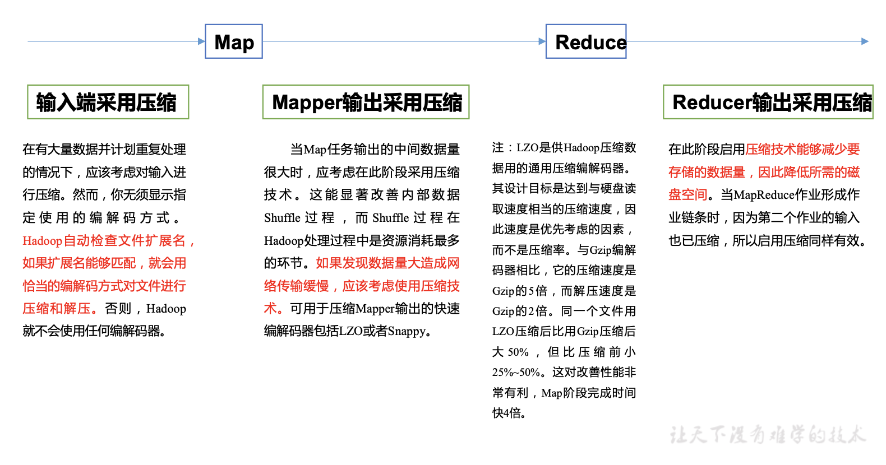

# 15.Hadoop数据压缩
## 15.1 概述
压缩技术能够有效减少底层存储系统(HDFS)读写字节数。压缩提高了网络带宽和磁盘空间的效率。在运行MR程序时，I/O操作、网络数据传输、Shuffle和Merge要花大量的时间，尤其是数据规模很大和工作负载密集的情况下，因此，使用数据压缩显得非常重要。  
鉴于磁盘I/O和网络带宽是Hadoop的宝贵资源，数据压缩对于节省资源、最小化磁盘I/O和网络传输非常有帮助。可以在任意MapReduce阶段启用压缩。不过，尽管压缩与解压操作的CPU开销不高，其性能的提升和资源的节省并非没有代价。  
压缩是提高Hadoop运行效率的一种优化策略。  
通过对Mapper、Reducer运行过程的数据进行压缩，以减少磁盘IO，提高MR程序运行速度。  
注意:采用压缩技术减少了磁盘IO，但同时增加了CPU运算负担。所以，压缩特性运用得当能提高性能，但运用不当也可能降低性能。  
压缩基本原则:  
   - 运算密集型的job，少用压缩
   - IO密集型的job，多用压缩

## 15.2 MR支持的压缩编码

| 压缩格式 | hadoop 自带? | 算法 | 文件扩展名 | 是否可切分 | 换成压缩格式后，原来的程序是否需要修改 |
| :-- | :-- | :-- | :-- | :-- | :-- |
| DEFLATE | 是，直接使用 | DEFLATE | .deflate | 否 | 和文本处理一样，不需要修改 |
| Gzip | 是，直接使用 | DEFLATE | .gz | 否 | 和文本处理一样，不需要修改 |
| bzip2 | 是，直接使用 | bzip2 | .bz2 | 是 | 和文本处理一样，不需要修改 |
| LZO | 否，需要安装 | LZO | .lzo | 是 | 需要建索引，还需要指定输入格式 |
| Snappy | 否，需要安装 | Snappy | .snappy | 否 | 和文本处理一样，不需要修改 |

为了支持多种压缩/解压缩算法，Hadoop 引入了编码/解码器，如下表所示。  

| 压缩格式 | 对应的编码/解码器 |
| :-- | :-- |
| DEFLATE | org.apache.hadoop.io.compress.DefaultCodec |
| gzip | org.apache.hadoop.io.compress.GzipCodec |
| bzip2 | org.apache.hadoop.io.compress.BZip2Codec |
| LZO | com.hadoop.compression.lzo.LzopCodec |
| Snappy | org.apache.hadoop.io.compress.SnappyCodec |

压缩性能的比较  

| 压缩算法 | 原始文件大小 | 压缩文件大小 | 压缩速度 | 解压速度 |
| :-- | :-- | :-- | :-- | :-- |
| gzip | 8.3GB | 1.8GB | 17.5MB/s | 58MB/s |
| bzip2 | 8.3GB | 1.1GB | 2.4MB/s | 9.5MB/s |
| LZO | 8.3GB | 2.9GB | 49.3MB/s | 74.6MB/s |

## 15.3 压缩方式选择
### 15.3.1 Gzip压缩
优点:压缩率比较高，而且压缩/解压速度也比较快;Hadoop本身支持，在应用中处理Gzip格式的文件就和直接处理文本一样;大部分Linux系统都自带Gzip命令，使用方便。  
缺点:不支持Split。  
应用场景:当每个文件压缩之后在130M以内的(1个块大小内)，都可以考虑用Gzip压缩格式。例如说一天或者一个小时的日志压缩成一个Gzip文件。

### 15.3.2 Bzip2压缩
优点:支持Split;具有很高的压缩率，比Gzip压缩率都高;Hadoop本身自带，使用方便。  
缺点:压缩/解压速度慢。  
应用场景:适合对速度要求不高，但需要较高的压缩率的时候;或者输出之后的数据比较大，处理之后的数据需要压缩存档减少磁盘空间并且以后数据用得比较少的情况;或者对单个很大的文本文件想压缩减少存储空间，同时又需要支持Split，而且兼容之前的应用程序的情况。  

### 15.3.3 Lzo压缩
优点:压缩/解压速度也比较快，合理的压缩率;支持Split，是Hadoop中最流行的压缩格式;可以在Linux系统下安装lzop命令，使用方便。  
缺点:压缩率比Gzip要低一些;Hadoop本身不支持，需要安装;在应用中对Lzo格式的文件需要做一些特殊处理(为了支持Split需要建索引，还需要指定InputFormat为Lzo格式)。  
应用场景:一个很大的文本文件，压缩之后还大于200M以上的可以考虑，而且单个文件越大，Lzo优点越越明显。  

### 15.3.4 Snappy压缩
优点:高速压缩速度和合理的压缩率。  
缺点:不支持Split;压缩率比Gzip要低;Hadoop本身不支持，需要安装。  
应用场景:当MapReduce作业的Map输出的数据比较大的时候，作为Map到Reduce的中间数据的压缩格式;或者作为一个MapReduce作业的输出和另外一个MapReduce作业的输入。  

## 15.4 压缩位置选择
  

## 15.5 压缩参数配置
| 参数 | 默认值 | 阶段 | 建议 |
| :-- | :-- | :-- | :-- |
| io.compression.codecs(在core-site.xml 中配置) | org.apache.hadoop.io.compress.DefaultCodec, org.apache.hadoop.io.compress.GzipCodec, org.apache.hadoop.io.compress.BZip2Codec | 输入压缩 | Hadoop使用文件扩展名判断是否支持某种编解码器 |
| mapreduce.map.output.compress(在mapred-site.xml中配置) | false | mapper输出 | 这个参数设为true启用压缩 |
| mapreduce.map.output.compress.codec(在mapred-site.xml中配置) | org.apache.hadoop.io.compress.DefaultCodec | mapper输出 | 企业多使用LZO或Snappy编解码器在此阶段压缩数据 |
| mapreduce.output.fileoutputformat.compress(在mapred-site.xml中配置) | false | reducer输出 | 这个参数设为true启用压缩 |
| mapreduce.output.fileoutputformat.compress.codec(在mapred-site.xml中配置) | org.apache.hadoop.io.compress.DefaultCodec | reducer输出 | 使用标准工具或者编解码器，如 gzip和bzip2 |
| mapreduce.output.fileoutputformat.compress.type(在mapred-site.xml中配置) | RECORD | reducer输出 | SequenceFile输出使用的压缩类型:NONE和BLOCK |

## 15.6 压缩实操案例
### 15.6.1 数据流的压缩和解压缩
CompressionCodec有两个方法可以用于轻松地压缩或解压缩数据。  
要想对正在被写入一个输出流的数据进行压缩，我们可以使用createOutputStream(OutputStreamout)方法创建一个CompressionOutputStream，将其以压缩格式写入底层的流。  
相反，要想对从输入流读取而来的数据进行解压缩，则调用createInputStream(InputStreamin)函数，从而获得一个CompressionInputStream，从而从底层的流读取未压缩的数据。  
```
package compress;

import org.apache.hadoop.conf.Configuration;
import org.apache.hadoop.fs.Path;
import org.apache.hadoop.io.IOUtils;
import org.apache.hadoop.io.compress.CompressionCodec;
import org.apache.hadoop.io.compress.CompressionCodecFactory;
import org.apache.hadoop.io.compress.CompressionInputStream;
import org.apache.hadoop.io.compress.CompressionOutputStream;
import org.apache.hadoop.util.ReflectionUtils;

import java.io.*;

public class TestCompress {
    public static void main(String[] args) throws IOException, ClassNotFoundException {
        //args[0]待压缩文件
        //args[1]压缩格式：例org.apache.hadoop.io.compress.GzipCodec
        compress(args[0], args[1]);
        //
        decompress(args[2]);
    }

    private static void decompress(String fileName) throws IOException {
        //0. 校验是否能够解压缩
        CompressionCodecFactory factory = new CompressionCodecFactory(new Configuration());
        CompressionCodec codec = factory.getCodec(new Path(fileName));
        if (codec == null) {
            return;
        }
        //1. 创建输入流
        FileInputStream fis = new FileInputStream(new File(fileName));
        CompressionInputStream cis = codec.createInputStream(fis);
        //2. 创建输出流
        FileOutputStream fos = new FileOutputStream(new File(fileName + ".deconde"));
        //3. 流的对拷
        IOUtils.copyBytes(cis, fos, 1024 * 1024, false);
        //4. 关闭资源
        fos.close();
        cis.close();
        fis.close();
    }

    private static void compress(String fileName, String method) throws IOException, ClassNotFoundException {
        //1. 创建输入流
        FileInputStream fis = new FileInputStream(new File(fileName));
        Class codecClass = Class.forName(method);
        CompressionCodec codec = (CompressionCodec) ReflectionUtils.newInstance(codecClass, new Configuration());
        //2. 创建输出流
        FileOutputStream fos = new FileOutputStream(new File(fileName + codec.getDefaultExtension()));
        CompressionOutputStream cos = codec.createOutputStream(fos);
        //3. 流的对拷
        IOUtils.copyBytes(fis, cos, 1024 * 1024, false);
        //4. 关闭资源
        cos.close();
        fos.close();
        fis.close();
    }
}
```

### 15.6.2 Map输出端采用压缩
```
//驱动类添加如下代码
// 开启map端输出压缩
configuration.setBoolean("mapreduce.map.output.compress",true);
// 设置map端输出压缩方式
configuration.setClass("mapreduce.map.output.compress.codec", BZip2Codec.class, CompressionCodec.class);
```

### 15.6.3 Reduce输出端采用压缩
```
//驱动类添加如下代码
// 设置reduce端输出压缩开启
FileOutputFormat.setCompressOutput(job, true);
// 设置压缩的方式
FileOutputFormat.setOutputCompressorClass(job, BZip2Codec.class);
```
