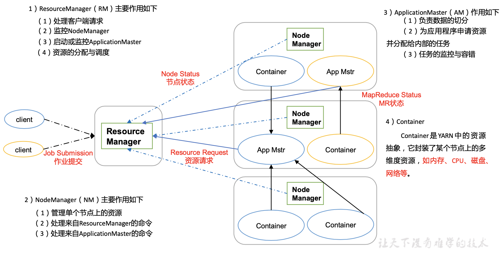
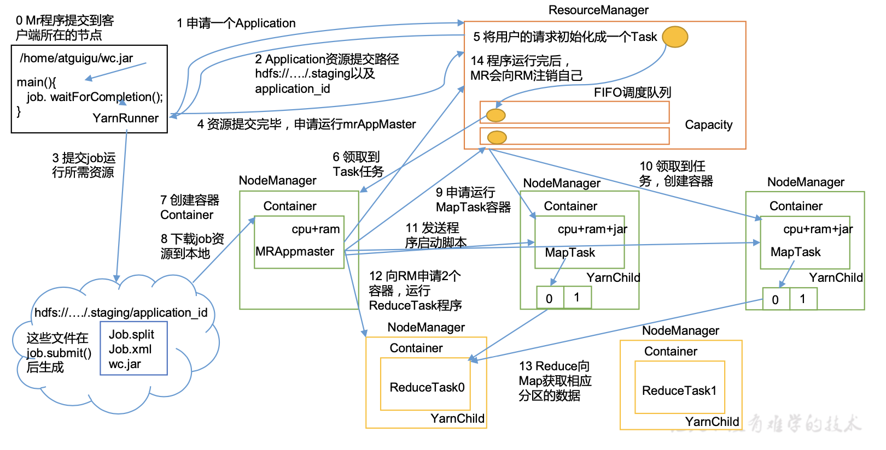
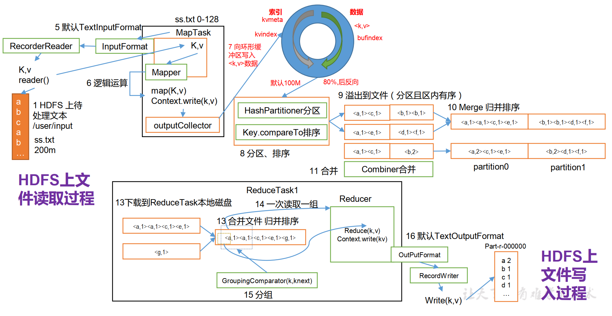
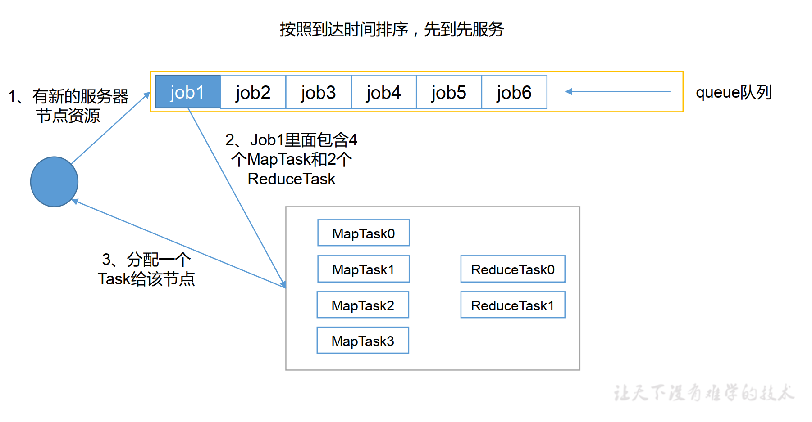
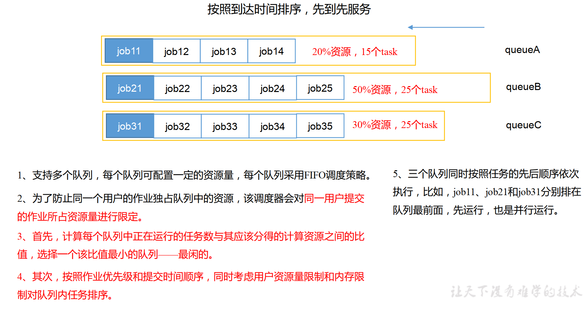
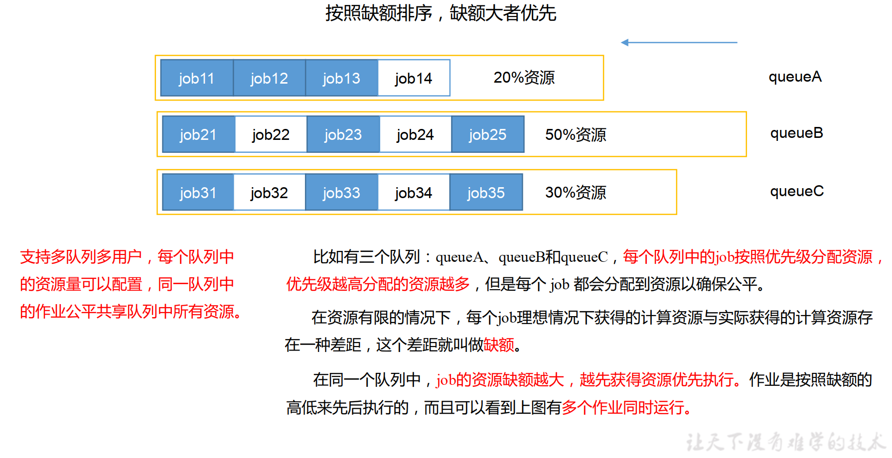
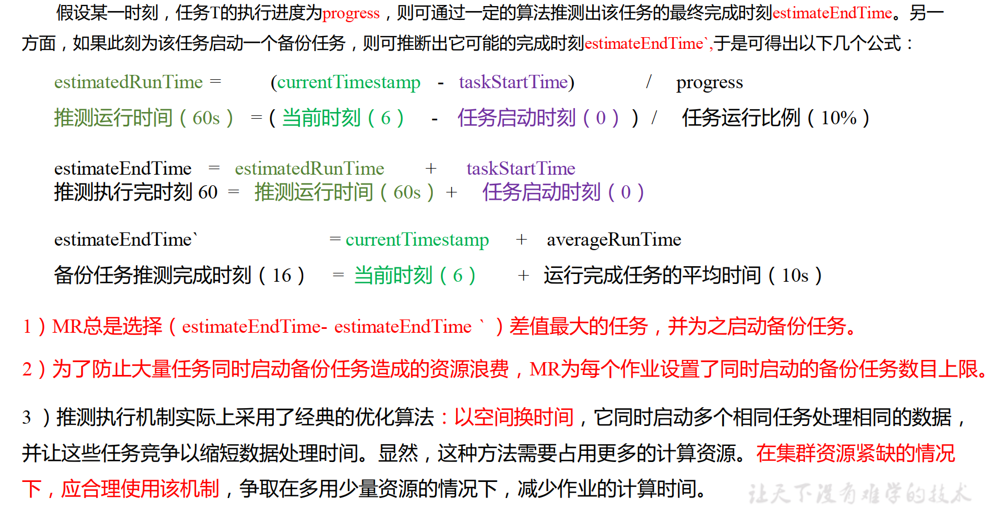

# 16.Yarn资源调度器
Yarn是一个资源调度平台，负责为运算程序提供服务器运算资源，相当于一个分布式的操作系统平台，而MapReduce等运算程序则相当于运行于操作系统之上的应用程序。  

## 16.1 Yarn基本架构
YARN主要由ResourceManager、NodeManager、ApplicationMaster和Container等组件构成。  
  

## 16.2 Yarn工作机制
1. Yarn运行机制  

2. 工作机制详解
   - MR程序提交到客户端所在的节点。
   - YarnRunner向ResourceManager申请一个Application。
   - RM将该应用程序的资源路径返回给YarnRunner。
   - 该程序将运行所需资源提交到HDFS上。
   - 程序资源提交完毕后，申请运行mrAppMaster。
   - RM将用户的请求初始化成一个Task。
   - 其中一个NodeManager领取到Task任务。
   - 该NodeManager创建容器Container，并产生MRAppmaster。
   - Container从HDFS上拷贝资源到本地。
   - MRAppmaster向RM申请运行MapTask资源。
   - RM将运行MapTask任务分配给另外两个NodeManager，另两个NodeManager分别领取任务并创建容器。
   - MR向两个接收到任务的NodeManager发送程序启动脚本，这两个NodeManager分别启动MapTask，MapTask对数据分区排序。
   - MrAppMaster等待所有MapTask运行完毕后，向RM申请容器，运行ReduceTask。
   - ReduceTask向MapTask获取相应分区的数据。
   - 程序运行完毕后，MR会向RM申请注销自己。

## 16.3 作业提交全过程
1. 作业提交过程之YARN
  
   - 作业提交
     - Client调用job.waitForCompletion方法，向整个集群提交MapReduce作业。
     - Client向RM申请一个作业id。
     - RM给Client返回该job资源的提交路径和作业id。
     - Client提交jar包、切片信息和配置文件到指定的资源提交路径。
     - Client提交完资源后，向RM申请运行MrAppMaster。
   - 作业初始化
     - 当RM收到Client的请求后，将该job添加到容量调度器中。
     - 某一个空闲的NM领取到该Job。
     - 该NM创建Container，并产生MRAppmaster。
     - 下载Client提交的资源到本地。
   - 任务分配
     - MrAppMaster向RM申请运行多个MapTask任务资源。
     - RM将运行MapTask任务分配给另外两个NodeManager， 另两个NodeManager分别领取任务并创建容器。
   - 任务运行
     - MR向两个接收到任务的NodeManager发送程序启动脚本，这两个NodeManager分别启动MapTask，MapTask对数据分区排序。
     - MrAppMaster等待所有MapTask运行完毕后，向RM申请容器，运行ReduceTask。
     - ReduceTask向MapTask获取相应分区的数据。
     - 程序运行完毕后，MR会向RM申请注销自己。
   - 进度和状态更新
     - YARN中的任务将其进度和状态(包括counter)返回给应用管理器, 客户端每秒(通过mapreduce.client.progressmonitor.pollinterval设置)向应用管理器请求进度更新,展示给用户。
   - 作业完成
     - 除了向应用管理器请求作业进度外,客户端每5秒都会通过调用waitForCompletion()来检查作业是否完成。时间间隔可以通过mapreduce.client.completion.pollinterval来设置。作业完成之后, 应用管理器和Container会清理工作状态。作业的信息会被作业历史服务器存储以备之后用户核查。
2. 作业提交过程之MapReduce
  

## 16.4 资源调度器
目前，Hadoop作业调度器主要有三种：FIFO、Capacity Scheduler和Fair Scheduler。Hadoop2.7.2默认的资源调度器是Capacity Scheduler。  
具体设置详见：yarn-default.xml文件  
```
<property>
    <description>The class to use as the resource scheduler.</description>
    <name>yarn.resourcemanager.scheduler.class</name>
    <value>org.apache.hadoop.yarn.server.resourcemanager.scheduler.capacity.CapacityScheduler</value>
</property>
```
1. 先进先出调度器（FIFO）
  
2. 容量调度器（Capacity Scheduler）
  
3. 公平调度器（Fair Scheduler）
  

## 16.5 任务的推测执行
1. 作业完成时间取决于最慢的任务完成时间
一个作业由若干个Map任务和Reduce任务构成。因硬件老化、软件Bug等，某些任务可能运行非常慢。  
2. 推测执行机制
发现拖后腿的任务，比如某个任务运行速度远慢于任务平均速度。为拖后腿任务启动一个备份任务，同时运行。谁先运行完，则采用谁的结果。  
3. 执行推测任务的前提条件
   - 每个Task只能有一个备份任务
   - 当前Job已完成的Task必须不小于0.05（5%）
   - 开启推测执行参数设置。mapred-site.xml文件中默认是打开的。
4. 不能启用推测执行机制情况
   - 任务间存在严重的负载倾斜
   - 特殊任务，比如任务向数据库中写数据
5. 算法原理
  
