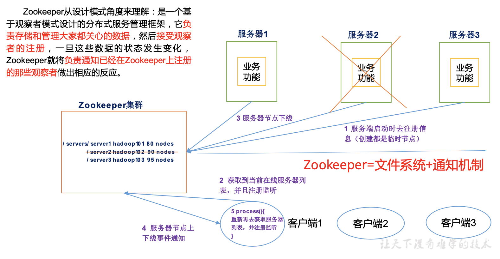
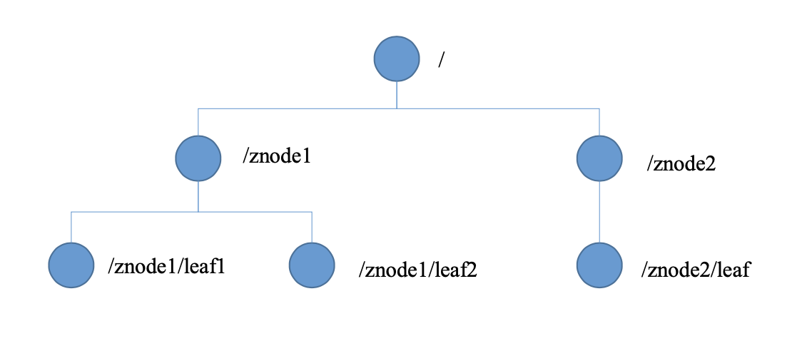
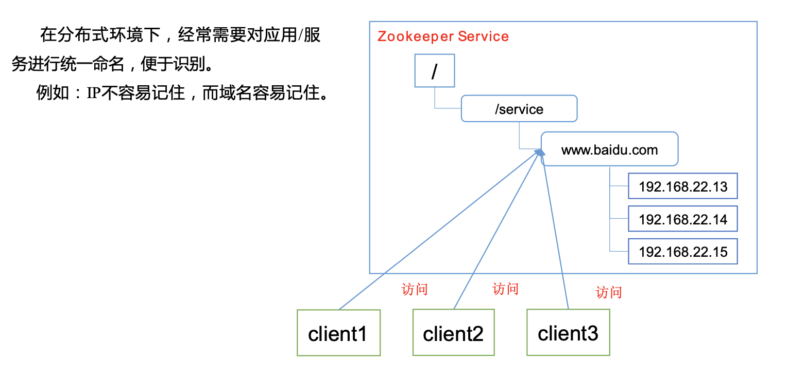
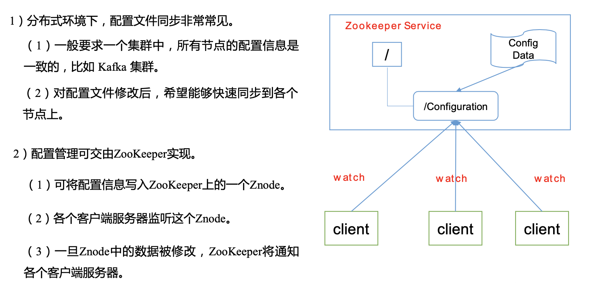
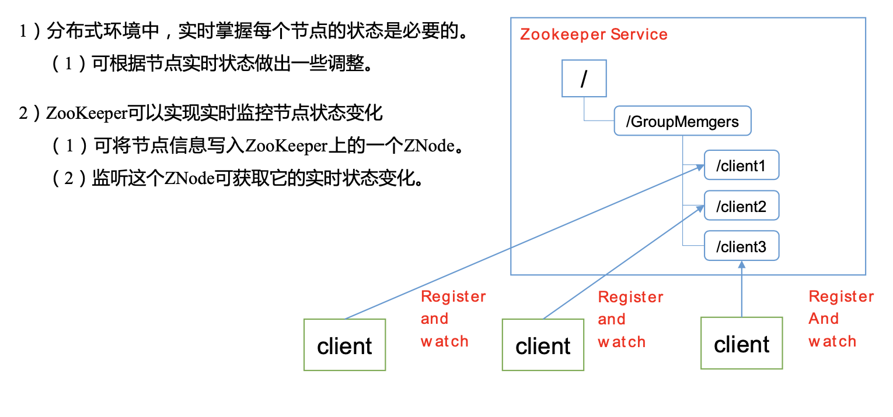
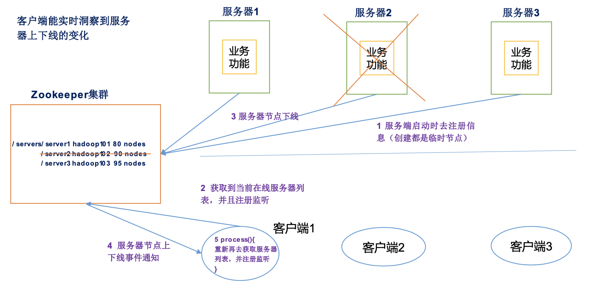

# 0.Zookeeper入门
## 0.1 概述
Zookeeper是一个开源的分布式的，为分布式应用提供协调服务的Apache项目。  
  

## 0.2 特点
  
1. Zookeeper:一个领导者(Leader)，多个跟随者(Follower)组成的集群。
2. 集群中只要有半数以上节点存活，Zookeeper集群就能正常服务。
3. 全局数据一致:每个Server保存一份相同的数据副本，Client无论连接到哪个Server，数据都是一致的。
4. 更新请求顺序进行，来自同一个Client的更新请求按其发送顺序依次执行。
5. 数据更新原子性，一次数据更新要么成功，要么失败。

## 0.3 数据结构
ZooKeeper数据模型的结构与Unix文件系统很类似，整体上可以看作是一棵树，每个节点称做一个ZNode。每一个ZNode默认能够存储1MB的数据，每个ZNode都可以通过其路径唯一标识。
  

## 0.4 应用场景
提供的服务包括:统一命名服务、统一配置管理、统一集群管理、服务器节点动态上下线、软负载均衡等。  
1. 统一命名服务
  
2. 统一配置管理
  
3. 统一集群管理
  
4. 服务器节点动态上下线

5. 软负载均衡
  

## 0.5 下载地址
官网(https://zookeeper.apache.org/)  
