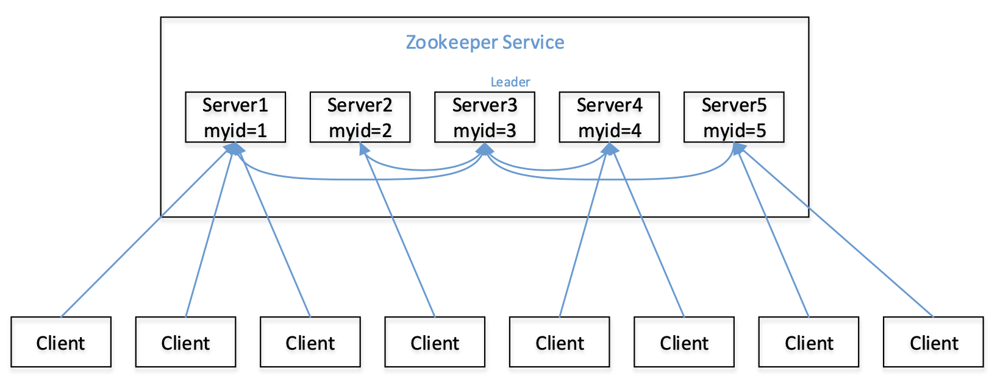
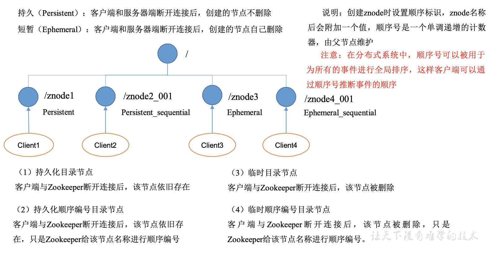
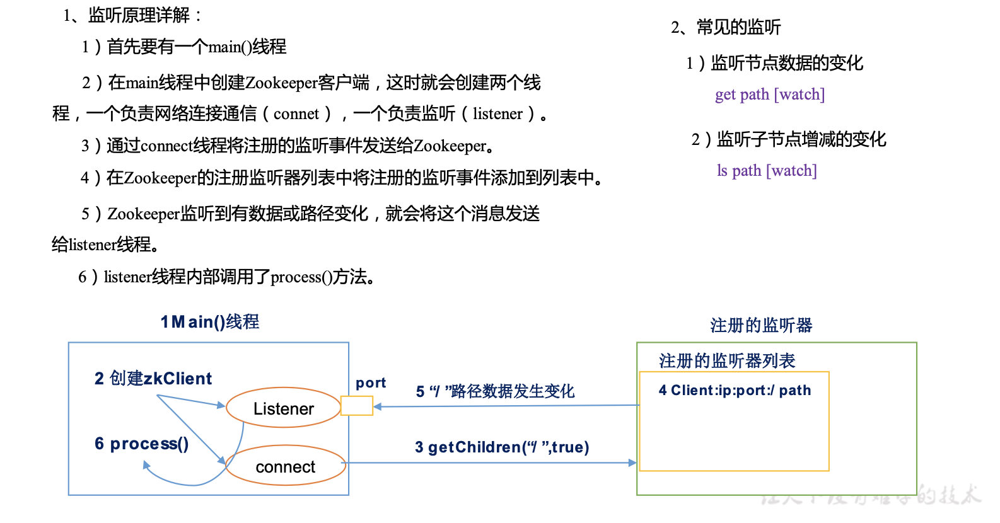
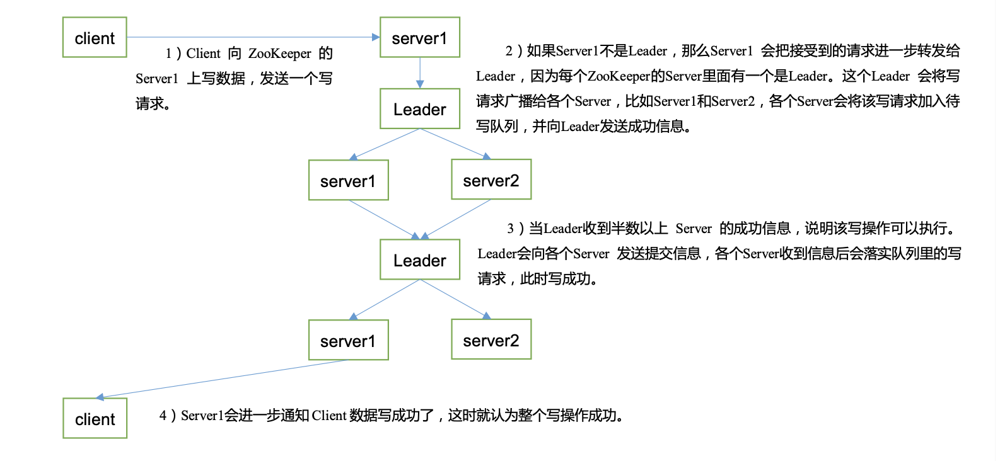

# 2.Zookeeper内部原理
## 2.1 选举机制
1. 半数机制:集群中半数以上机器存活，集群可用。所以Zookeeper适合安装奇数台服务器。
2. Zookeeper虽然在配置文件中并没有指定Master和Slave。但是，Zookeeper工作时，是有一个节点为Leader，其他则为Follower，Leader是通过内部的选举机制临时产生的。
3. 以一个简单的例子来说明整个选举的过程。
假设有五台服务器组成的Zookeeper集群，它们的id从1-5，同时它们都是最新启动的，也就是没有历史数据，在存放数据量这一点上，都是一样的。假设这些服务器依序启动，来看看会发生什么，如图所示。  
  
   - 服务器1启动，发起一次选举。服务器1投自己一票。此时服务器1票数一票，不够半数以上(3票)，选举无法完成，服务器1状态保持为LOOKING;  
   - 服务器2启动，再发起一次选举。服务器1和2分别投自己一票并交换选票信息: 此时服务器1发现服务器2的ID比自己目前投票推举的(服务器1)大，更改选票为推举服务器2。此时服务器1票数0票，服务器2票数2票，没有半数以上结果，选举无法完成，服务器1，2状态保持LOOKING;  
   - 服务器3启动，发起一次选举。此时服务器1和2都会更改选票为服务器3。此次投票结果:服务器1为0票，服务器2为0票，服务器3为3票。此时服务器3的票数已 经超过半数，服务器3当选Leader。服务器1，2更改状态为FOLLOWING，服务器3更改状态为LEADING;  
   - 服务器4启动，发起一次选举。此时服务器1，2，3已经不是LOOKING状态，不会更改选票信息。交换选票信息结果:服务器3为3票，服务器4为1票。此时服务器4服从多数，更改选票信息为服务器3，并更改状态为FOLLOWING;  
   - 服务器5启动，同4一样当小弟。  

## 2.2 节点类型

## 2.3 Stat结构体
1. czxid-创建节点的事务zxid  
每次修改ZooKeeper状态都会收到一个zxid形式的时间戳，也就是ZooKeeper事务ID。事务ID是ZooKeeper中所有修改总的次序。每个修改都有唯一的zxid，如果 zxid1小于zxid2，那么zxid1在zxid2之前发生。  
2. ctime-znode被创建的毫秒数(从1970年开始)
3. mzxid-znode最后更新的事务zxid
4. mtime-znode最后修改的毫秒数(从1970年开始)
5. pZxid-znode最后更新的子节点zxid
6. cversion-znode子节点变化号，znode子节点修改次数
7. dataversion-znode数据变化号
8. aclVersion-znode访问控制列表的变化号
9. ephemeralOwner-如果是临时节点，这个是znode拥有者的session id。如果不是临时节点则是0。
10. dataLength-znode的数据长度
11. numChildren-znode子节点数量

## 2.4 监听器原理
  

## 2.5 写数据流程

