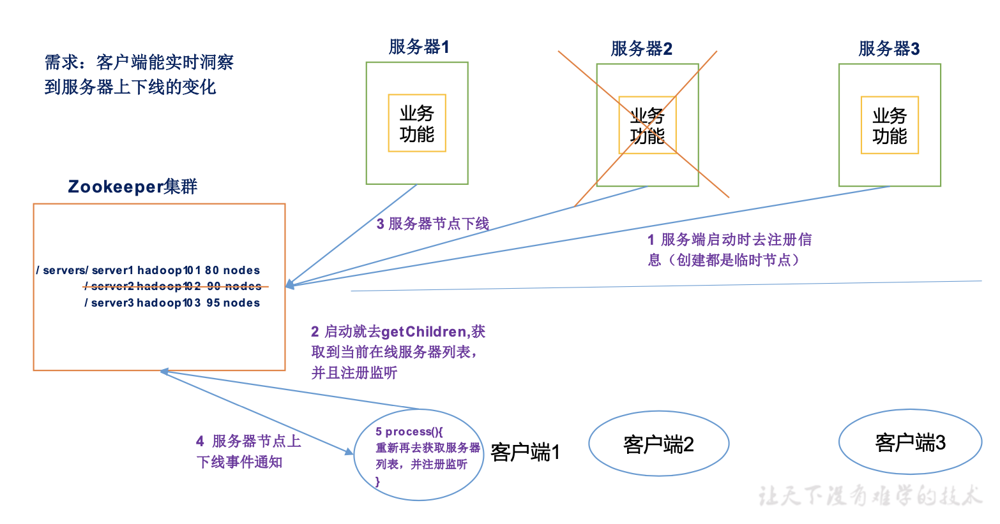

# 3.Zookeeper实战
## 3.1 分布式安装部署
1. 集群规划  
在hadoop01、hadoop02和hadoop03三个节点上部署Zookeeper。
2. 解压安装  
   - 解压Zookeeper安装包到/opt/module/目录下
    ```
    [hadoop@hadoop01 software]$ tar -xvf apache-zookeeper-3.6.2-bin.tar -C /opt/module/
    ```
   - 同步/opt/module/apache-zookeeper-3.6.2-bin目录内容到hadoop02、hadoop03
    ```
    [hadoop@hadoop01 apache-zookeeper-3.6.2-bin]$ scp -r /opt/module/apache-zookeeper-3.6.2-bin/ hadoop@hadoop02:/opt/module/
    [hadoop@hadoop01 apache-zookeeper-3.6.2-bin]$ scp -r /opt/module/apache-zookeeper-3.6.2-bin/ hadoop@hadoop03:/opt/module/
    ```
3. 配置服务器编号
   - 在/opt/module/apache-zookeeper-3.6.2-bin这个目录下创建zkData
    ```
    [hadoop@hadoop01 apache-zookeeper-3.6.2-bin]$ mkdir zkData
    ```
   - 在/opt/module/apache-zookeeper-3.6.2-bin/zkData目录下创建一个myid的文件
    ```
    [hadoop@hadoop01 zkData]$ touch myid
    ```
   - 编辑myid文件
    ```
    [hadoop@hadoop01 zkData]$ vi myid
    在文件中添加与server对应的编号:
    1
    ```
   - 拷贝配置好的zookeeper到其他机器上
    ```
    [hadoop@hadoop01 zkData]$ scp myid hadoop@hadoop02:/opt/module/apache-zookeeper-3.6.2-bin/zkData/
    [hadoop@hadoop01 zkData]$ scp myid hadoop@hadoop03:/opt/module/apache-zookeeper-3.6.2-bin/zkData/
    ```
   - 并分别在hadoop02、hadoop03上修改myid文件中内容为2、3
4. 配置zoo.cfg文件
   - 重命名/opt/module/apache-zookeeper-3.6.2-bin/conf这个目录下的zoo_sample.cfg为zoo.cfg
    ```
    [hadoop@hadoop01 conf]$ mv zoo_sample.cfg zoo.cfg
    ```
   - 打开zoo.cfg文件
    ```
    [hadoop@hadoop01 conf]$ vi zoo.cfg
    修改数据存储路径配置
    dataDir=/opt/module/apache-zookeeper-3.6.2-bin/zkData
    增加如下配置
    #######################cluster##########################
    server.1=hadoop01:2888:3888
    server.2=hadoop02:2888:3888
    server.3=hadoop03:2888:3888
    ```
   - 同步zoo.cfg配置文件
    ```
    [hadoop@hadoop01 conf]$ scp zoo.cfg hadoop@hadoop02:/opt/module/apache-zookeeper-3.6.2-bin/conf/
    [hadoop@hadoop01 conf]$ scp zoo.cfg hadoop@hadoop03:/opt/module/apache-zookeeper-3.6.2-bin/conf/
    ```
   - 配置参数解读
    ```
    server.A=B:C:D
    A是一个数字，表示这个是第几号服务器;
    集群模式下配置一个文件myid，这个文件在dataDir目录下，这个文件里面有一个数据就是A的值，Zookeeper启动时读取此文件，拿到里面的数据与zoo.cfg里面的配置信息比较从而判断到底是哪个server。
    B是这个服务器的地址;
    C是这个服务器Follower与集群中的Leader服务器交换信息的端口;
    D是万一集群中的Leader服务器挂了，需要一个端口来重新进行选举，选出一个新的Leader，而这个端口就是用来执行选举时服务器相互通信的端口。
    ```
5. 集群操作
   - 分别启动Zookeeper
    ```
    [hadoop@hadoop01 apache-zookeeper-3.6.2-bin]$ bin/zkServer.sh start
    [hadoop@hadoop02 apache-zookeeper-3.6.2-bin]$ bin/zkServer.sh start
    [hadoop@hadoop03 apache-zookeeper-3.6.2-bin]$ bin/zkServer.sh start
    ```
   - 查看状态
    ```
    [hadoop@hadoop01 apache-zookeeper-3.6.2-bin]$ bin/zkServer.sh status
    ZooKeeper JMX enabled by default
    Using config: /opt/module/apache-zookeeper-3.6.2-bin/bin/../conf/zoo.cfg
    Client port found: 2181. Client address: localhost. Client SSL: false.
    Mode: follower
    [hadoop@hadoop02 apache-zookeeper-3.6.2-bin]$ bin/zkServer.sh status
    ZooKeeper JMX enabled by default
    Using config: /opt/module/apache-zookeeper-3.6.2-bin/bin/../conf/zoo.cfg
    Client port found: 2181. Client address: localhost. Client SSL: false.
    Mode: leader
    [hadoop@hadoop03 apache-zookeeper-3.6.2-bin]$ bin/zkServer.sh status
    ZooKeeper JMX enabled by default
    Using config: /opt/module/apache-zookeeper-3.6.2-bin/bin/../conf/zoo.cfg
    Client port found: 2181. Client address: localhost. Client SSL: false.
    Mode: follower
    ```

## 3.2 客户端命令行操作

| 命令基本语法 | 功能描述 |
| :-- | :-- |
| help | 显示所有操作命令 |
| ls path [watch] | 使用 ls 命令来查看当前 znode 中所包含的内容 |
| ls2 path [watch] | 查看当前节点数据并能看到更新次数等数据 |
| create | 普通创建 [-s 含有序列 -e 临时(重启或者超时消失)] |
| get path [watch] | 获得节点的值 |
| set | 设置节点的具体值 |
| stat | 查看节点状态 |
| delete | 删除节点 |
| rmr | 递归删除节点 |

1. 启动客户端
```
[hadoop@hadoop01 apache-zookeeper-3.6.2-bin]$ bin/zkCli.sh
```
2. 显示所有操作命令
```
[zk: localhost:2181(CONNECTED) 0] help
```
3. 查看当前 znode 中所包含的内容
```
[zk: localhost:2181(CONNECTED) 1] ls /
[zookeeper]
```
4. 查看当前节点详细数据
```
[zk: localhost:2181(CONNECTED) 3] ls -s /
[zookeeper]
cZxid = 0x0
ctime = Thu Jan 01 08:00:00 CST 1970
mZxid = 0x0
mtime = Thu Jan 01 08:00:00 CST 1970
pZxid = 0x0
cversion = -1
dataVersion = 0
aclVersion = 0
ephemeralOwner = 0x0
dataLength = 0
numChildren = 1
```
5. 分别创建2个普通节点
```
[zk: localhost:2181(CONNECTED) 4] create /sanguo "jinlian"
Created /sanguo
[zk: localhost:2181(CONNECTED) 5] create /sanguo/shuguo "liubei"
Created /sanguo/shuguo
```
6. 获得节点的值
```
[zk: localhost:2181(CONNECTED) 9] get -s /sanguo
jinlian
cZxid = 0x200000002
ctime = Tue Jan 05 16:35:37 CST 2021
mZxid = 0x200000002
mtime = Tue Jan 05 16:35:37 CST 2021
pZxid = 0x200000003
cversion = 1
dataVersion = 0
aclVersion = 0
ephemeralOwner = 0x0
dataLength = 7
numChildren = 1
[zk: localhost:2181(CONNECTED) 10] get -s /sanguo/shuguo
liubei
cZxid = 0x200000003
ctime = Tue Jan 05 16:36:01 CST 2021
mZxid = 0x200000003
mtime = Tue Jan 05 16:36:01 CST 2021
pZxid = 0x200000003
cversion = 0
dataVersion = 0
aclVersion = 0
ephemeralOwner = 0x0
dataLength = 6
numChildren = 0
```
7. 创建短暂节点
```
[zk: localhost:2181(CONNECTED) 11] create -e /sanguo/wuguo "zhouyu"
Created /sanguo/wuguo
```
   - 在当前客户端是能查看到的
   ```
   [zk: localhost:2181(CONNECTED) 12] ls /sanguo
   [shuguo, wuguo]
   ```
   - 退出当前客户端然后再重启客户端
   ```
   [zk: localhost:2181(CONNECTED) 13] quit
   [hadoop@hadoop01 apache-zookeeper-3.6.2-bin]$ bin/zkCli.sh
   ```
   - 再次查看根目录下短暂节点已经删除
   ```
   [zk: localhost:2181(CONNECTED) 0] ls /sanguo
   [shuguo]
   ```
8. 创建带序号的节点
   - 先创建一个普通的根节点/sanguo/weiguo
   ```
   [zk: localhost:2181(CONNECTED) 1] create /sanguo/weiguo "caocao"
   Created /sanguo/weiguo
   ```
   - 创建带序号的节点
   ```
   [zk: localhost:2181(CONNECTED) 2] create -s /sanguo/weiguo/xiaoqiao "jinlian"
   Created /sanguo/weiguo/xiaoqiao0000000000
   [zk: localhost:2181(CONNECTED) 3] create -s /sanguo/weiguo/xiaoqiao "jinlian"
   Created /sanguo/weiguo/xiaoqiao0000000001
   [zk: localhost:2181(CONNECTED) 4] create -s /sanguo/weiguo/xiaoqiao "jinlian"
   Created /sanguo/weiguo/xiaoqiao0000000002
   ```
如果原来没有序号节点，序号从0开始依次递增。如果原节点下已有2个节点，则再排序时从2开始，以此类推。  
9. 修改节点数据值
```
set /sanguo/weiguo "simayi"
```
10. 节点的值变化监听
    - 在hadoop03主机上注册监听/sanguo节点数据变化
    ```
    [zk: localhost:2181(CONNECTED) 0] get /sanguo watch
    ```
    - 在hadoop01主机上修改/sanguo节点的数据
    ```
    [zk: localhost:2181(CONNECTED) 6] set /sanguo "xisi"
    ```
    - 观察hadoop03主机收到数据变化的监听
    ```
    WATCHER::

    WatchedEvent state:SyncConnected type:NodeDataChanged path:/sanguo
    ```
11. 节点的子节点变化监听(路径变化)
    - 在hadoop03主机上注册监听/sanguo节点的子节点变化
    ```
    [zk: localhost:2181(CONNECTED) 1] ls /sanguo watch
    'ls path [watch]' has been deprecated. Please use 'ls [-w] path' instead.
    [shuguo, weiguo]
    ```
    - 在hadoop01主机/sanguo节点上创建子节点
    ```
    [zk: localhost:2181(CONNECTED) 7] create /sanguo/jin "simayi"
    Created /sanguo/jin
    ```
    - 观察hadoop03主机收到子节点变化的监听
    ```
    WATCHER::

    WatchedEvent state:SyncConnected type:NodeChildrenChanged path:/sanguo
    ```
12. 删除节点
```
[zk: localhost:2181(CONNECTED) 10] delete /sanguo/jin
```
13. 递归删除节点
```
[zk: localhost:2181(CONNECTED) 12] deleteall /sanguo/shuguo
```
14. 查看节点状态
```
[zk: localhost:2181(CONNECTED) 13] stat /sanguo
cZxid = 0x200000002
ctime = Tue Jan 05 16:35:37 CST 2021
mZxid = 0x20000000d
mtime = Tue Jan 05 16:51:54 CST 2021
pZxid = 0x200000010
cversion = 7
dataVersion = 1
aclVersion = 0
ephemeralOwner = 0x0
dataLength = 4
numChildren = 1
```

## 3.3 API应用
### 3.3.1 IDEA环境搭建
1. 创建一个Maven工程
2. 添加pom文件
```
<dependencies>
    <!-- https://mvnrepository.com/artifact/junit/junit -->
    <dependency>
        <groupId>junit</groupId>
        <artifactId>junit</artifactId>
        <version>4.12</version>
        <scope>test</scope>
    </dependency>
    <!-- https://mvnrepository.com/artifact/org.apache.logging.log4j/log4j-core -->
    <dependency>
        <groupId>org.apache.logging.log4j</groupId>
        <artifactId>log4j-core</artifactId>
        <version>2.12.1</version>
    </dependency>
    <!-- https://mvnrepository.com/artifact/org.apache.zookeeper/zookeeper -->
    <dependency>
        <groupId>org.apache.zookeeper</groupId>
        <artifactId>zookeeper</artifactId>
        <version>3.6.2</version>
    </dependency>
</dependencies>
```
3. 拷贝log4j.properties文件到项目根目录
需要在项目的src/main/resources目录下，新建一个文件，命名为“log4j.properties”，在文件中填入。  
```
log4j.rootLogger=INFO, stdout
log4j.appender.stdout=org.apache.log4j.ConsoleAppender
log4j.appender.stdout.layout=org.apache.log4j.PatternLayout
log4j.appender.stdout.layout.ConversionPattern=%d %p [%c] - %m%n
log4j.appender.logfile=org.apache.log4j.FileAppender
log4j.appender.logfile.File=target/spring.log
log4j.appender.logfile.layout=org.apache.log4j.PatternLayout
log4j.appender.logfile.layout.ConversionPattern=%d %p [%c] - %m%n
```

### 3.3.2 创建ZooKeeper客户端
```
package com.hu3ky;

import org.apache.zookeeper.WatchedEvent;
import org.apache.zookeeper.Watcher;
import org.apache.zookeeper.ZooKeeper;
import org.junit.Test;

import java.io.IOException;

public class TestZookeeper {
    private String connectString = "hadoop01:2181,hadoop02:2181,hadoop03:2181";
    private int sessionTimeout = 2000;
    private ZooKeeper zkCilent;

    @Test
    public void init() throws IOException {
        zkCilent = new ZooKeeper(connectString, sessionTimeout, new Watcher() {
            @Override
            public void process(WatchedEvent watchedEvent) {

            }
        });
    }
}
```

### 3.3.3 创建子节点
```
package com.hu3ky;

import org.apache.zookeeper.*;
import org.junit.Before;
import org.junit.Test;

import java.io.IOException;
import java.util.List;

public class TestZookeeper {
    private String connectString = "hadoop01:2181,hadoop02:2181,hadoop03:2181";
    private int sessionTimeout = 2000;
    private ZooKeeper zkCilent;

    @Before
    public void init() throws IOException {
        zkCilent = new ZooKeeper(connectString, sessionTimeout, new Watcher() {
            @Override
            public void process(WatchedEvent watchedEvent) {

            }
        });
    }

    @Test
    public void create() throws KeeperException, InterruptedException {
        String path = zkCilent.create("/study", "hadoop".getBytes(), ZooDefs.Ids.OPEN_ACL_UNSAFE, CreateMode.PERSISTENT);
        System.out.println(path);
    }
}
```

### 3.3.4 获取子节点并监听节点变化
```
package com.hu3ky;

import org.apache.zookeeper.*;
import org.junit.Before;
import org.junit.Test;

import java.io.IOException;
import java.util.List;

public class TestZookeeper {
    private String connectString = "hadoop01:2181,hadoop02:2181,hadoop03:2181";
    private int sessionTimeout = 2000;
    private ZooKeeper zkCilent;

    @Before
    public void init() throws IOException {
        zkCilent = new ZooKeeper(connectString, sessionTimeout, new Watcher() {
            @Override
            public void process(WatchedEvent watchedEvent) {
                System.out.println("--------------start-------------");
                List<String> children = null;
                try {
                    children = zkCilent.getChildren("/", true);
                } catch (KeeperException e) {
                    e.printStackTrace();
                } catch (InterruptedException e) {
                    e.printStackTrace();
                }
                for (String child : children) {
                    System.out.println(child);
                }
                System.out.println("--------------end-------------");
            }
        });
    }

    @Test
    public void create() throws KeeperException, InterruptedException {
        String path = zkCilent.create("/study", "hadoop".getBytes(), ZooDefs.Ids.OPEN_ACL_UNSAFE, CreateMode.PERSISTENT);
        System.out.println(path);
    }

    @Test
    public void getDataAndWatch() throws KeeperException, InterruptedException {
        List<String> children = zkCilent.getChildren("/", true);
        Thread.sleep(Long.MAX_VALUE);
    }
}
```

### 3.3.5 判断Znode是否存在
```
package com.hu3ky;

import org.apache.zookeeper.*;
import org.apache.zookeeper.data.Stat;
import org.junit.Before;
import org.junit.Test;

import java.io.IOException;
import java.util.List;

public class TestZookeeper {
    private String connectString = "hadoop01:2181,hadoop02:2181,hadoop03:2181";
    private int sessionTimeout = 2000;
    private ZooKeeper zkCilent;

    @Before
    public void init() throws IOException {
        zkCilent = new ZooKeeper(connectString, sessionTimeout, new Watcher() {
            @Override
            public void process(WatchedEvent watchedEvent) {
//                System.out.println("--------------start-------------");
//                List<String> children = null;
//                try {
//                    children = zkCilent.getChildren("/", true);
//                } catch (KeeperException e) {
//                    e.printStackTrace();
//                } catch (InterruptedException e) {
//                    e.printStackTrace();
//                }
//                for (String child : children) {
//                    System.out.println(child);
//                }
//                System.out.println("--------------end-------------");
            }
        });
    }

    @Test
    public void create() throws KeeperException, InterruptedException {
        String path = zkCilent.create("/study", "hadoop".getBytes(), ZooDefs.Ids.OPEN_ACL_UNSAFE, CreateMode.PERSISTENT);
        System.out.println(path);
    }

    @Test
    public void getDataAndWatch() throws KeeperException, InterruptedException {
        List<String> children = zkCilent.getChildren("/", true);
        Thread.sleep(Long.MAX_VALUE);
    }

    @Test
    public void exist() throws KeeperException, InterruptedException {
        Stat stat = zkCilent.exists("/study", false);
        System.out.println(stat == null ? "no exist" : "exist");
    }
}
```

## 3.4 监听服务器节点动态上下线案例
1. 需求  
某分布式系统中，主节点可以有多台，可以动态上下线，任意一台客户端都能实时感知到主节点服务器的上下线。  
2. 需求分析  
  
3. 具体实现  
   - 先在集群上创建/servers 节点
    ```
    [zk: localhost:2181(CONNECTED) 2] create /servers "servers"
    Created /servers
    ```
   - 服务器端向Zookeeper注册代码
    ```
    package com.hu3ky;

    import org.apache.zookeeper.*;

    import java.io.IOException;

    public class DistributeServer {
        String connectString = "hadoop01:2181,hadoop02:2181,hadoop03:2181";
        int sessionTimeout = 2000;
        ZooKeeper zk;

        public static void main(String[] args) throws IOException, KeeperException, InterruptedException {
            DistributeServer server = new DistributeServer();
            //1. 创建zookeeper连接
            server.getConnect();
            //2. 注册服务器
            server.registServer(args[0]);
            //3. 业务逻辑
            server.business();
        }

        private void business() throws InterruptedException {
            Thread.sleep(Long.MAX_VALUE);
        }

        private void registServer(String hostName) throws KeeperException, InterruptedException {
            String path = "/servers/server";
            String result = zk.create(path, hostName.getBytes(), ZooDefs.Ids.OPEN_ACL_UNSAFE, CreateMode.EPHEMERAL_SEQUENTIAL);
            System.out.println(result + "is online");
        }

        private void getConnect() throws IOException {
            zk = new ZooKeeper(connectString, sessionTimeout, new Watcher() {
                @Override
                public void process(WatchedEvent watchedEvent) {

                }
            });
        }
    }

    ```
   - 客户端代码
    ```
    package com.hu3ky;

    import org.apache.zookeeper.KeeperException;
    import org.apache.zookeeper.WatchedEvent;
    import org.apache.zookeeper.Watcher;
    import org.apache.zookeeper.ZooKeeper;

    import java.io.IOException;
    import java.util.ArrayList;
    import java.util.List;

    public class DistributeClient {
        private String connectString = "hadoop01:2181,hadoop02:2181,hadoop03:2181";
        private int sessionTimeout = 2000;
        private ZooKeeper zk;

        public static void main(String[] args) throws IOException, KeeperException, InterruptedException {
            DistributeClient client = new DistributeClient();
            //1. 创建zookeeper连接
            client.getConnect();
            //2. 获取servers的子节点信息，从中获取服务器信息列表
            client.getServerList();
            //3. 业务逻辑
            client.business();
        }

        private void business() throws InterruptedException {
            Thread.sleep(Long.MAX_VALUE);
        }

        private void getServerList() throws KeeperException, InterruptedException {
            String path = "/servers";
            List<String> children = zk.getChildren(path, true);
            List<String> servers = new ArrayList<>();
            for (String child : children) {
                servers.add(new String(zk.getData(path + "/" + child, false, null)));
            }
            System.out.println(servers);
        }

        private void getConnect() throws IOException {
            //String connectString, int sessionTimeout, Watcher watcher
            zk = new ZooKeeper(connectString, sessionTimeout, new Watcher() {
                @Override
                public void process(WatchedEvent watchedEvent) {
                    try {
                        getServerList();
                    } catch (KeeperException e) {
                        e.printStackTrace();
                    } catch (InterruptedException e) {
                        e.printStackTrace();
                    }
                }
            });
        }
    }
    ```
