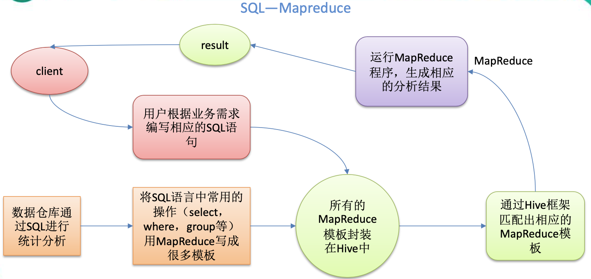
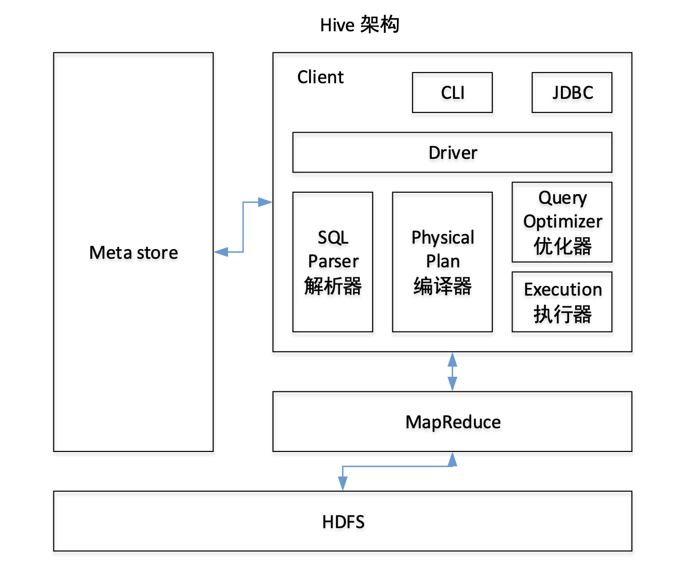
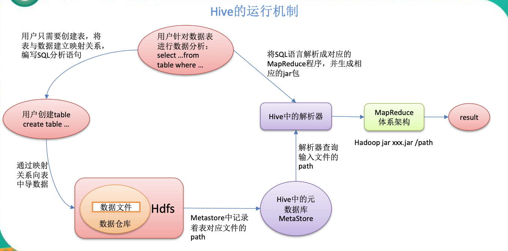

# 0.Hive基本概念
## 0.1 什么是Hive
Hive:由Facebook开源用于解决海量结构化日志的数据统计。  
Hive是基于Hadoop的一个数据仓库工具，可以将结构化的数据文件映射为一张表，并提供类SQL查询功能。  
本质是:将HQL转化成MapReduce程序。  
  
1. Hive处理的数据存储在HDFS
2. Hive分析数据底层的实现是MapReduce
3. 执行程序运行在Yarn上

## 0.2 Hive的优缺点
### 0.2.1 优点  
1. 操作接口采用类SQL语法，提供快速开发的能力(简单、容易上手)。
2. 避免了去写MapReduce，减少开发人员的学习成本。  
3. Hive的执行延迟比较高，因此Hive常用于数据分析，对实时性要求不高的场合。  
4. Hive优势在于处理大数据，对于处理小数据没有优势，因为Hive的执行延迟比较高。  
5. Hive支持用户自定义函数，用户可以根据自己的需求来实现自己的函数。  

### 0.2.2 缺点
1. Hive的HQL表达能力有限
   - 迭代式算法无法表达
   - 数据挖掘方面不擅长，由于MapReduce数据处理流程的限制，效率更高的算法却无法实现。
2. Hive的效率比较低
   - Hive自动生成的MapReduce作业，通常情况下不够智能化
   - Hive调优比较困难，粒度较粗

## 0.3 Hive架构原理  
  
1. 用户接口:Client  
CLI(command-line interface)、JDBC/ODBC(jdbc访问hive)、WEBU(I浏览器访问hive)  
2. 元数据:Metastore  
元数据包括:表名、表所属的数据库(默认是default)、表的拥有者、列/分区字段、表的类型(是否是外部表)、表的数据所在目录等;  
默认存储在自带的derby数据库中，推荐使用MySQL存储Metastore  
3. Hadoop  
使用HDFS进行存储，使用MapReduce进行计算。
4. 驱动器:Driver  
   - 解析器(SQL Parser):将SQL字符串转换成抽象语法树AST，这一步一般都用第三方工具库完成，比如antlr;对AST进行语法分析，比如表是否存在、字段是否存在、SQL语义是否有误。
   - 编译器(Physical Plan):将AST编译生成逻辑执行计划。
   - 优化器(Query Optimizer):对逻辑执行计划进行优化。
   - 执行器(Execution):把逻辑执行计划转换成可以运行的物理计划。对于Hive来说，就是MR/Spark。
  
Hive通过给用户提供的一系列交互接口，接收到用户的指令(SQL)，使用自己的Driver，结合元数据(MetaStore)，将这些指令翻译成MapReduce，提交到Hadoop中执行，最后，将执行返回的结果输出到用户交互接口。

## 0.4 Hive和数据库比较
由于Hive采用了类似SQL的查询语言HQL(Hive Query Language)，因此很容易将Hive理解为数据库。其实从结构上来看，Hive和数据库除了拥有类似的查询语言，再无类似之处。本文将从多个方面来阐述Hive和数据库的差异。数据库可以用在Online的应用中，但是Hive是为数据仓库而设计的，清楚这一点，有助于从应用角度理解Hive的特性。  

### 0.4.1 查询语言
由于SQL被广泛的应用在数据仓库中，因此，专门针对Hive的特性设计了类SQL的查询语言HQL。熟悉SQL开发的开发者可以很方便的使用Hive进行开发。  

### 0.4.2 数据存储位置
Hive是建立在Hadoop之上的，所有Hive的数据都是存储在HDFS中的。而数据库则可以将数据保存在块设备或者本地文件系统中。  

### 0.4.3 数据更新  
由于Hive是针对数据仓库应用设计的，而数据仓库的内容是读多写少的。因此，Hive中不建议对数据的改写，所有的数据都是在加载的时候确定好的。而数据库中的数据通常是需要经常进行修改的，因此可以使用INSERTINTO... VALUES添加数据，使用UPDATE ... SET修改数据。  

### 0.4.4 执行  
Hive中大多数查询的执行是通过Hadoop提供的MapReduce来实现的。而数据库通常有自己的执行引擎。  

### 0.4.5 执行延迟  
Hive在查询数据的时候，由于没有索引，需要扫描整个表，因此延迟较高。另外一个导致Hive执行延迟高的因素是MapReduce框架。由于MapReduce本身具有较高的延迟，因此在利用MapReduce执行Hive查询时，也会有较高的延迟。相对的，数据库的执行延迟较低。当然，这个低是有条件的，即数据规模较小，当数据规模大到超过数据库的处理能力的时候，Hive的并行计算显然能体现出优势。  

### 0.4.6 可扩展性  
由于Hive是建立在Hadoop之上的，因此Hive的可扩展性是和Hadoop的可扩展性是一致的(世界上最大的Hadoop集群在Yahoo!，2009年的规模在4000台节点左右)。而数据库由于ACID语义的严格限制，扩展行非常有限。目前最先进的并行数据库Oracle在理论上的扩展能力也只有100台左右。  

### 0.4.7 数据规模
由于Hive建立在集群上并可以利用MapReduce进行并行计算，因此可以支持很大规模的数据;对应的，数据库可以支持的数据规模较小。  
