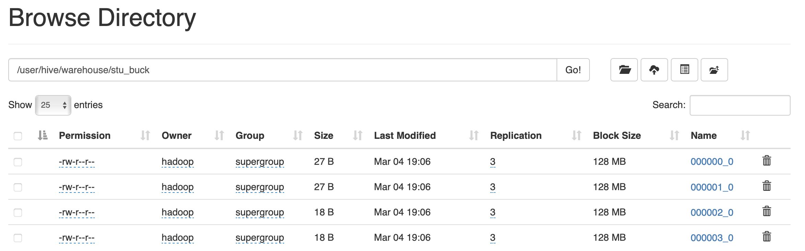

# 6.分区表和分桶表
## 6.1 分区表  
分区表实际上就是对应一个HDFS文件系统上的独立的文件夹，该文件夹下是该分区所有的数据文件。Hive中的分区就是分目录，把一个大的数据集根据业务需要分割成小的数据集。在查询时通过WHERE子句中的表达式选择查询所需要的指定的分区，这样的查询效率会提高很多。  

### 6.1.1 分区表基本操作
1. 引入分区表（需要根据日期对日志进行管理, 通过部门信息模拟）  
```
dept_20200401.log
dept_20200402.log
dept_20200403.log
```
2. 创建分区表语法  
```
hive (default)> create table dept_partition(
              > deptno int, dname string, loc string)
              > partitioned by (day string)
              > row format delimited fields terminated by '\t';
```  
注意：分区字段不能是表中已经存在的数据，可以将分区字段看作表的伪列。
3. 加载数据到分区表中
   - 数据准备
     - dept_20200401.log
        ```
        10	ACCOUNTING	1700
        20	RESEARCH	1800
        ```
     - dept_20200402.log
        ```
        30	SALES	1900
        40	OPERATIONS	1700
        ```
     - dept_20200403.log
        ```
        5	Test	2000
        6	Dev	3000
        ```
   - 加载数据
    ```
    hive (default)> load data local inpath '/opt/module/apache-hive-3.1.2-bin/datas/dept_20200401.log' into table dept_partition partition(day='20200401');
    hive (default)> load data local inpath '/opt/module/apache-hive-3.1.2-bin/datas/dept_20200402.log' into table dept_partition partition(day='20200402');
    hive (default)> load data local inpath '/opt/module/apache-hive-3.1.2-bin/datas/dept_20200403.log' into table dept_partition partition(day='20200403');
    ```  
注意：分区表加载数据时，必须指定分区  
4. 查询分区表中数据
   - 单分区查询
    ```
    select * from dept_partition where day='20200401';
    ```
   - 多分区联合查询
    ```
    hive (default)> select * from dept_partition where day='20200401'
                  > union
                  > select * from dept_partition where day='20200402'
                  > union
                  > select * from dept_partition where day='20200403';
    hive (default)> select * from dept_partition where day='20200401' or day='20200402' or day='20200403';
    ```
5. 增加分区
   - 创建单个分区
    ```
    hive (default)> alter table dept_partition add partition(day='20200404');
    ```
   - 同时创建多个分区
    ```
    hive (default)> alter table dept_partition add partition(day='20200405') partition(day='20200406');
    ```
6. 删除分区
   - 删除多个分区
    ```
    hive (default)> alter table dept_partition drop partition (day='20200404');
    ```
   - 同时删除多个分区
    ```
    hive (default)> alter table dept_partition drop partition (day='20200405'),partition (day='20200406');
    ```
7. 查看分区表有多少分区
```
hive (default)> show partitions dept_partition;
```
8. 查看分区表结构
```
hive (default)> desc formatted dept_partition;
# Partition Information	 	 
# col_name            	data_type           	comment             
day                 	string    
```

### 6.1.2 二级分区
思考:如何一天的日志数据量也很大，如何再将数据拆分?  
1. 创建二级分区表
```
hive (default)> create table dept_partition2
              > (deptno int, dname string, loc string)
              > partitioned by (day string, hour string)
              > row format delimited fields terminated by '\t';
```
2. 正常的加载数据
   - 加载数据到二级分区表中
    ```
    hive (default)> load data local inpath '/opt/module/apache-hive-3.1.2-bin/datas/dept_20200401.log' into table dept_partition2 partition(day='20200401',hour='12');
    ```
   - 查询分区数据
    ```
    hive (default)> select * from dept_partition2 where day='20200401' and hour='12';
    ```
3. 把数据直接上传到分区目录上，让分区表和数据产生关联的三种方式
   - 上传数据后修复
     - 上传数据
        ```
        hive (default)> dfs -mkdir -p /user/hive/warehouse/dept_partition2/day=20200401/hour=13;
        hive (default)> dfs -put /opt/module/apache-hive-3.1.2-bin/datas/dept_20200401.log /user/hive/warehouse/dept_partition2/day=20200401/hour=13;
        ```
     - 查询数据(查询不到刚上传的数据)
        ```
        hive (default)> select * from dept_partition2 where day='20200401' and hour='13';
        ```
     - 执行修复命令
        ```
        hive (default)> msck repair table dept_partition2;
        ```
     - 再次查询数据
        ```
        hive (default)> select * from dept_partition2 where day='20200401' and hour='13';
        ```
   - 上传数据后添加分区
     - 上传数据
        ```
        hive (default)> dfs -mkdir -p /user/hive/warehouse/dept_partition2/day=20200401/hour=14;
        hive (default)> dfs -put /opt/module/apache-hive-3.1.2-bin/datas/dept_20200401.log /user/hive/warehouse/dept_partition2/day=20200401/hour=14;
        ```
     - 执行添加分区
        ```
        hive (default)> alter table dept_partition2 add partition(day='201709',hour='14');
        ```
     - 查询数据
        ```
        hive (default)> select * from dept_partition2 where day='201709' and hour='14';
        ```
   - 创建文件夹后load数据到分区
     - 创建目录
        ```
        hive (default)> dfs -mkdir -p /user/hive/warehouse/dept_partition2/day=20200401/hour=15;
        ```
     - 上传数据
        ```
        hive (default)> load data local inpath '/opt/module/apache-hive-3.1.2-bin/datas/dept_20200401.log' into table dept_partition2 partition(day='201709',hour='14');
        ```
     - 查询数据
        ```
        hive (default)> select * from dept_partition2 where day='201709' and hour='14';
        ```

### 6.1.3 动态分区调整
关系型数据库中，对分区表Insert数据时候，数据库自动会根据分区字段的值，将数据插入到相应的分区中，Hive中也提供了类似的机制，即动态分区(Dynamic Partition)，只不过，使用Hive的动态分区，需要进行相应的配置。  
1. 开启动态分区参数设置
   - 开启动态分区功能(默认true，开启)
    ```
    hive (default)> set hive.exec.dynamic.partition;
    hive.exec.dynamic.partition=true
    ```
   - 设置为非严格模式(动态分区的模式，默认strict，表示必须指定至少一个分区为静态分区，nonstrict模式表示允许所有的分区字段都可以使用动态分区。)
    ```
    hive (default)> set hive.exec.dynamic.partition.mode=nonstrict;
    ```
   - 在所有执行MR的节点上，最大一共可以创建多少个动态分区。默认1000
    ```
    hive (default)> set hive.exec.max.dynamic.partitions;
    hive.exec.max.dynamic.partitions=1000
    ```
   - 在每个执行MR的节点上，最大可以创建多少个动态分区。该参数需要根据实际的数据来设定。比如：源数据中包含了一年的数据，即day字段有365个值，那么该参数就需要设置成大于365，如果使用默认值100，则会报错
    ```
    hive (default)> set hive.exec.max.dynamic.partitions.pernode;
    hive.exec.max.dynamic.partitions.pernode=100
    ```
   - 整个MR Job中，最大可以创建多少个HDFS文件。默认100000
    ```
    hive (default)> set hive.exec.max.created.files;
    hive.exec.max.created.files=100000
    ```
   - 当有空分区生成时，是否抛出异常。一般不需要设置。默认false
    ```
    hive (default)> set hive.error.on.empty.partition;
    hive.error.on.empty.partition=false
    ```
2. 案例实操  
需求：将dept表中的数据按照地区(loc字段)，插入到目标表dept_partition的相应分区中  
   - 创建目标分区表
    ```
    hive (default)> create table dept_partition_dy(id int, name string) partitioned by (loc int) row format delimited fields terminated by '\t';
    ```
   - 设置动态分区
    ```
    hive (default)> set hive.exec.dynamic.partition.mode=nonstrict;
    hive (default)> insert into table dept_partition_dy partition(loc) select deptno, dname, loc from dept;
    ```
   - 查看目标分区表的分区情况
    ```
    hive (default)> show partitions dept_partition;
    ```

## 6.2 分桶表  
分区提供一个隔离数据和优化查询的便利方式。不过，并非所有的数据集都可形成合理的分区。对于一张表或者分区，Hive可以进一步组织成桶，也就是更为细粒度的数据范围划分。  
分桶是将数据集分解成更容易管理的若干部分的另一个技术。  
分区针对的是数据的存储路径；分桶针对的是数据文件。  
1. 先创建分桶表
   - 数据准备
    ```
    1000	ss0
    1001	ss1
    1002	ss2
    1003	ss3
    1004	ss4
    1005	ss5
    1006	ss6
    1007	ss7
    1008	ss8
    1009	ss9
    ```
   - 创建分桶表
    ```
    hive (default)> create table stu_buck(id int,name string)
                  > clustered by(id)
                  > into 4 buckets
                  > row format delimited fields terminated by '\t';
    ```
   - 查看表结构
    ```
    hive (default)> desc formatted stu_buck;
    Num Buckets:        	4
    ```
   - 导入数据到分桶表中，load的方式
    ```
    hive (default)> load data inpath '/stu_buck' into table stu_buck;
    ```
   - 查看创建的分桶表中是否分成4个桶  
       
   - 查询分桶的数据
    ```
    hive (default)> select * from stu_buck;
    ```
   - 分桶规则  
   根据结果可知：Hive的分桶采用对分桶字段的值进行哈希，然后除以桶的个数求余的方式决定该条记录存放在哪个桶当中  
2. 分桶表操作需要注意的事项:
   - reduce的个数设置为-1,让Job自行决定需要用多少个reduce或者将reduce的个数设置为大于等于分桶表的桶数  
   - 从hdfs中load数据到分桶表中，避免本地文件找不到问题
   - 不要使用本地模式
3. insert方式将数据导入分桶表
    ```
    hive (default)> insert into table stu_buck select * from student_insert;
    ```

## 6.3 抽样查询  
对于非常大的数据集，有时用户需要使用的是一个具有代表性的查询结果而不是全部结果。Hive可以通过对表进行抽样来满足这个需求  
语法: `TABLESAMPLE(BUCKET x OUT OF y)`  
查询表stu_buck中的数据  
```
hive (default)> select * from stu_buck tablesample(bucket 1 out of 4 on id);
```
注意：x的值必须小于等于y的值，否则  
```
FAILED: SemanticException [Error 10061]: Numerator should not be bigger than denominator in sample clause for table stu_buck
```
