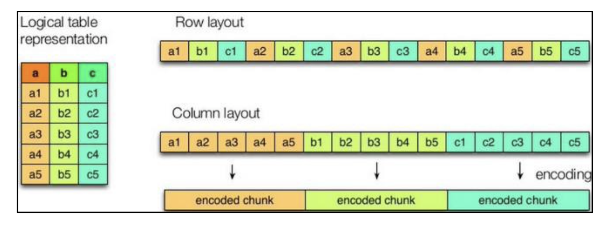
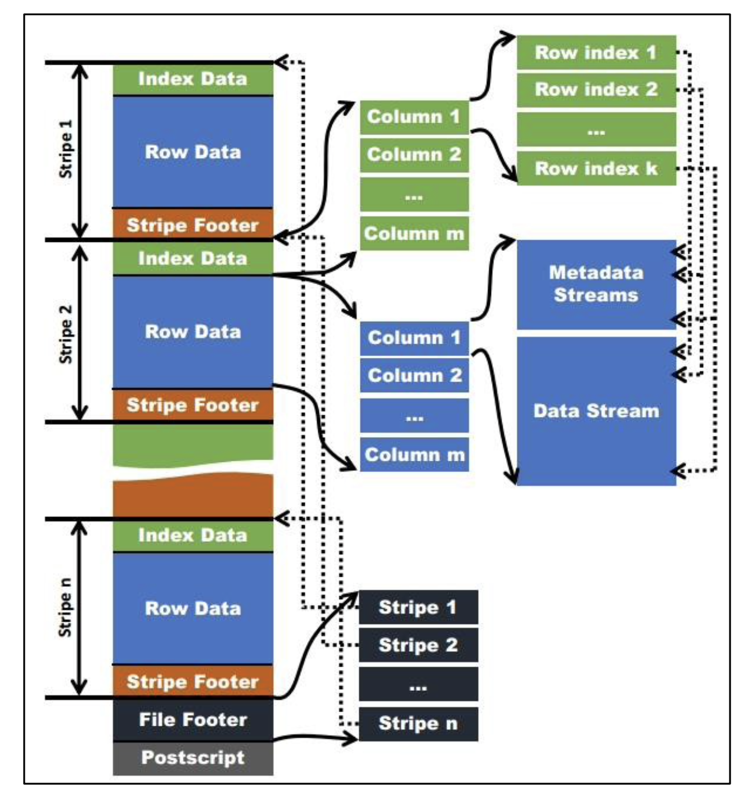
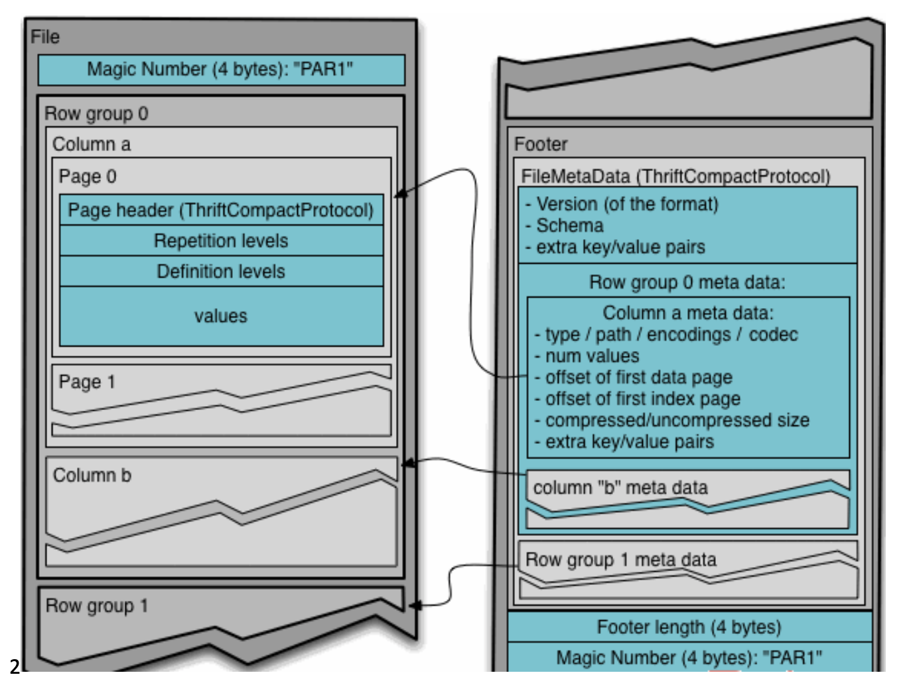

# 8.压缩和存储
## 8.1 Hadoop压缩配置
### 8.1.1 MR支持的压缩编码

| 压缩格式 | hadoop 自带? | 算法 | 文件扩展名 | 是否可切分 | 换成压缩格式后，原来的程序是否需要修改 |
| :-- | :-- | :-- | :-- | :-- | :-- |
| DEFLATE | 是，直接使用 | DEFLATE | .deflate | 否 | 和文本处理一样，不需要修改 |
| Gzip | 是，直接使用 | DEFLATE | .gz | 否 | 和文本处理一样，不需要修改 |
| bzip2 | 是，直接使用 | bzip2 | .bz2 | 是 | 和文本处理一样，不需要修改 |
| LZO | 否，需要安装 | LZO | .lzo | 是 | 需要建索引，还需要指定输入格式 |
| Snappy | 否，需要安装 | Snappy | .snappy | 否 | 和文本处理一样，不需要修改 |

为了支持多种压缩/解压缩算法，Hadoop 引入了编码/解码器，如下表所示。  

| 压缩格式 | 对应的编码/解码器 |
| :-- | :-- |
| DEFLATE | org.apache.hadoop.io.compress.DefaultCodec |
| gzip | org.apache.hadoop.io.compress.GzipCodec |
| bzip2 | org.apache.hadoop.io.compress.BZip2Codec |
| LZO | com.hadoop.compression.lzo.LzopCodec |
| Snappy | org.apache.hadoop.io.compress.SnappyCodec |

压缩性能的比较  

| 压缩算法 | 原始文件大小 | 压缩文件大小 | 压缩速度 | 解压速度 |
| :-- | :-- | :-- | :-- | :-- |
| gzip | 8.3GB | 1.8GB | 17.5MB/s | 58MB/s |
| bzip2 | 8.3GB | 1.1GB | 2.4MB/s | 9.5MB/s |
| LZO | 8.3GB | 2.9GB | 49.3MB/s | 74.6MB/s |

### 8.1.2 压缩参数配置

| 参数 | 默认值 | 阶段 | 建议 |
| :-- | :-- | :-- | :-- |
| io.compression.codecs(在core-site.xml 中配置) | org.apache.hadoop.io.compress.DefaultCodec, org.apache.hadoop.io.compress.GzipCodec, org.apache.hadoop.io.compress.BZip2Codec | 输入压缩 | Hadoop使用文件扩展名判断是否支持某种编解码器 |
| mapreduce.map.output.compress(在mapred-site.xml中配置) | false | mapper输出 | 这个参数设为true启用压缩 |
| mapreduce.map.output.compress.codec(在mapred-site.xml中配置) | org.apache.hadoop.io.compress.DefaultCodec | mapper输出 | 企业多使用LZO或Snappy编解码器在此阶段压缩数据 |
| mapreduce.output.fileoutputformat.compress(在mapred-site.xml中配置) | false | reducer输出 | 这个参数设为true启用压缩 |
| mapreduce.output.fileoutputformat.compress.codec(在mapred-site.xml中配置) | org.apache.hadoop.io.compress.DefaultCodec | reducer输出 | 使用标准工具或者编解码器，如 gzip和bzip2 |
| mapreduce.output.fileoutputformat.compress.type(在mapred-site.xml中配置) | RECORD | reducer输出 | SequenceFile输出使用的压缩类型:NONE和BLOCK |

## 8.2 开启Map输出阶段压缩(MR引擎)
开启map输出阶段压缩可以减少job中map和Reduce task间数据传输量。具体配置如下:  
1. 案例实操:
   - 开启hive中间传输数据压缩功能
    ```
    hive (default)> set hive.exec.compress.intermediate=true;
    ```
   - 开启mapreduce中map输出压缩功能
    ```
    hive (default)> set mapreduce.map.output.compress=true;
    ```
   - 设置mapreduce中map输出数据的压缩方式
    ```
    hive (default)> set mapreduce.map.output.compress.codec=org.apache.hadoop.io.compress.SnappyCodec;
    ```
   - 执行查询语句
    ```
    hive (default)> select count(ename) name from emp;
    ```

## 8.3 开启Reduce输出阶段压缩
当Hive将输出写入到表中时，输出内容同样可以进行压缩。属性hive.exec.compress.output控制着这个功能。用户可能需要保持默认设置文件中的默认值false，这样默认的输出就是非压缩的纯文本文件了。用户可以通过在查询语句或执行脚本中设置这个值为true，来开启输出结果压缩功能。  
1. 案例实操
   - 开启hive最终输出数据压缩功能
    ```
    hive (default)> set hive.exec.compress.output=true;
    ```
   - 开启mapreduce最终输出数据压缩
    ```
    hive (default)> set mapreduce.output.fileoutputformat.compress=true;
    ```
   - 设置mapreduce最终数据输出压缩方式
    ```
    hive (default)> set mapreduce.output.fileoutputformat.compress.codec = org.apache.hadoop.io.compress.SnappyCodec;
    ```
   - 设置mapreduce最终数据输出压缩为块压缩
    ```
    hive (default)> set mapreduce.output.fileoutputformat.compress.type=BLOCK;
    ```
   - 测试一下输出结果是否是压缩文件
    ```
    hive (default)> insert overwrite local directory '/opt/module/data/ distribute-result' select * from emp distribute by deptno sort by empno desc;
    ```

## 8.4 文件存储格式
Hive支持的存储数据的格式主要有:TEXTFILE、SEQUENCEFILE、ORC、PARQUET。  

### 8.4.1 列式存储和行式存储
  
如图所示左边为逻辑表，右边第一个为行式存储，第二个为列式存储。  
1. 行存储的特点:查询满足条件的一整行数据的时候，列存储则需要去每个聚集的字段找到对应的每个列的值，行存储只需要找到其中一个值，其余的值都在相邻地方，所以此时行存储查询的速度更快。
2. 列存储的特点:因为每个字段的数据聚集存储，在查询只需要少数几个字段的时候，能大大减少读取的数据量;每个字段的数据类型一定是相同的，列式存储可以针对性的设􏰀更好的设􏰀压缩算法。
3. TEXTFILE和SEQUENCEFILE的存储格式都是基于行存储的。
4. ORC和PARQUET是基于列式存储的。

### 8.4.2 TextFile格式
默认格式，数据不做压缩，磁盘开销大，数据解析开销大。可结合Gzip、Bzip2使用，但使用Gzip这种方式，hive不会对数据进行切分，从而无法对数据进行并行操作。  

### 8.4.3 Orc格式
  
Orc(Optimized Row Columnar)是Hive 0.11版里引入的新的存储格式。  
如图所示可以看到每个Orc文件由1个或多个stripe组成，每个stripe一般为HDFS的块大小，每一个stripe包含多条记录，这些记录按照列进行独立存储，对应到 Parquet中的row group的概念。每个Stripe里有三部分组成，分别是Index Data，Row Data，Stripe Footer。  
1. Index Data:一个轻量级的index，默认是每隔1W行做一个索引。这里做的索引应该只是记录某行的各字段在Row Data中的offset。
2. Row Data:存的是具体的数据，先取部分行，然后对这些行按列进行存储。对每个列进行了编码，分成多个Stream来存储。
3. Stripe Footer:存的是各个Stream的类型，长度等信息。  
每个文件有一个File Footer，这里面存的是每个Stripe的行数，每个Column的数据类型信息等;每个文件的尾部是一个PostScript，这里面记录了整个文件的压缩类型以及FileFooter的长度信息等。在读取文件时，会seek到文件尾部读PostScript，从里面解析到File Footer长度，再读FileFooter，从里面解析到各个 Stripe信息，再读各个Stripe，即从后往前读。

### 8.4.4 Parquet格式
Parquet文件是以二进制方式存储的，所以是不可以直接读取的，文件中包括该文件数据和元数据，因此Parquet格式文件是自解析的。  
1. 行组(Row Group):每一个行组包含一定的行数，在一个HDFS文件中至少存储一个行组，类似于orc的stripe的概念。
2. 列块(Column Chunk):在一个行组中每一列保存在一个列块中，行组中的所有列连续的存储在这个行组文件中。一个列块中的值都是相同类型的，不同的列块可能使用不同的算法进行压缩。
3. 页(Page):每一个列块划分为多个页，一个页是最小的编码的单位，在同一个列块的不同页可能使用不同的编码方式。  
通常情况下，在存储Parquet数据的时候会按照Block大小设置行组的大小，由于一般情况下每一个Mapper任务处理数据的最小单位是一个Block，这样可以把每一个行组由一个Mapper任务处理，增大任务执行并行度。Parquet文件的格式。  
  
上图展示了一个Parquet文件的内容，一个文件中可以存储多个行组，文件的首位都是该文件的Magic Code，用于校验它是否是一个Parquet文件，Footer length记录了文件元数据的大小，通过该值和文件长度可以􏰀算出元数据的偏移量，文件的元数据中包括每一个行组的元数据信息和该文件存储数据的Schema信息。除了文件中每一个行组的元数据，每一页的开始都会存储该页的元数据，在Parquet中，有三种类型的页:数据页、字典页和索引页。数据页用于存储当前行组中该列的值，字典页存储该列值的编码字典，每一个列块中最多包含一个字典页，索引页用来存储当前行组下该列的索引，目前Parquet中还不支持索引页。  
