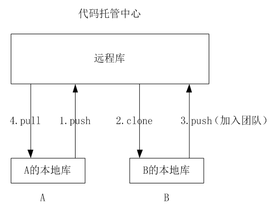
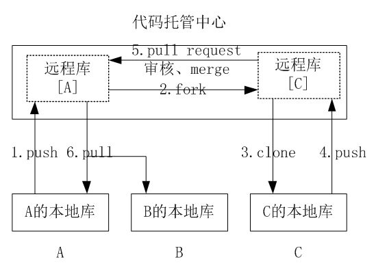

#**0.Git的简介**
##**0.1特点:**  
&emsp;&emsp;Git是一种分布式的版本控制工具。  
##**0.2优点:**  
&emsp;&emsp;1.大部分操作在本地完成，不需要联网  
&emsp;&emsp;2.完整性保证  
&emsp;&emsp;3.尽可能添加数据而不是删除修改数据  
&emsp;&emsp;4.分支操作非常快捷流畅  
&emsp;&emsp;5.与linux命令全面兼容  
##**0.3Git和代码托管中心**
&emsp;&emsp;代码托管中心的任务:维护远程库
###**0.3.1局域网环境:**
&emsp;&emsp;GitLab服务器(自建)
###**0.3.2外网环境:**
&emsp;&emsp;GitHub(https://github.com/)  
&emsp;&emsp;码云(https://gitee.com/)  
##**0.4本地库与远程库**
###**0.4.1团队内部协作**
&emsp;&emsp;  
###**0.4.2跨团队协作**
&emsp;&emsp;