# **1.Git的安装**  
## **1.1WindowsGit的安装**  
### **1.1.1下载安装文件**  
&emsp;&emsp;首先打开git的[官网](https://git-scm.com/)，然后下载与操作系统相对应的32位或64位的安装文件。  
&emsp;&emsp;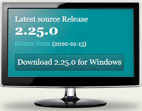  
### **1.1.2进行安装**  
&emsp;&emsp;双击下载好的安装文件  
&emsp;&emsp;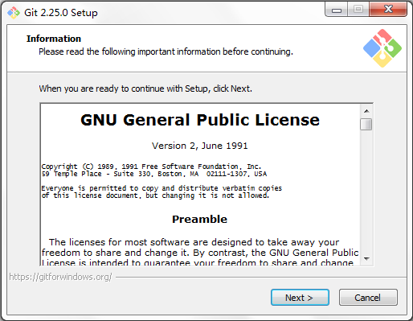  
&emsp;&emsp;点击Next  
&emsp;&emsp;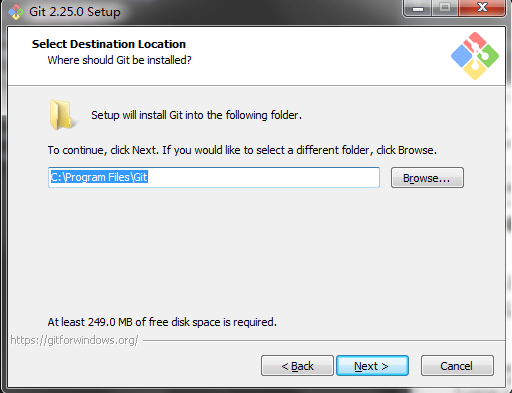  
&emsp;&emsp;选择安装位置，点击Next  
&emsp;&emsp;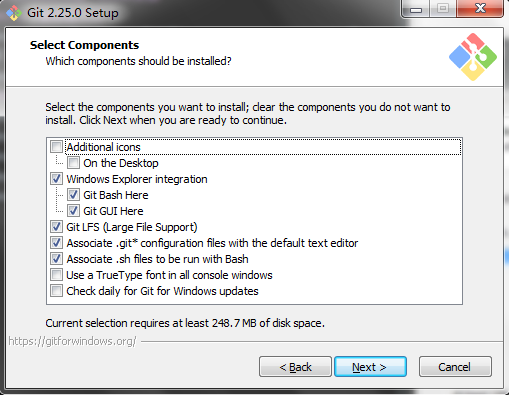  
&emsp;&emsp;关于此页，我们按照默认的勾选就可以了，直接点击Next  
&emsp;&emsp;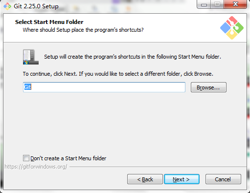  
&emsp;&emsp;也是按照默认内容就可以，直接点击Next  
&emsp;&emsp;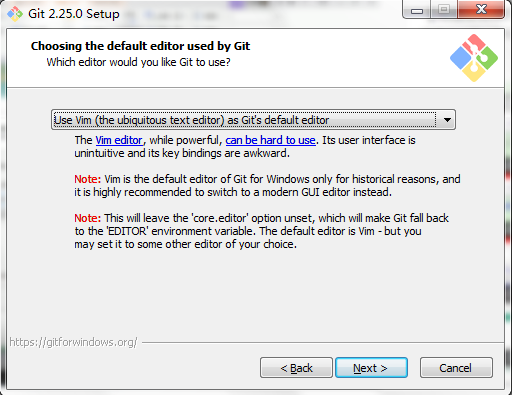  
&emsp;&emsp;这里是选择默认的文本编辑器，推荐使用默认选项(vim)，然后点击Next  
&emsp;&emsp;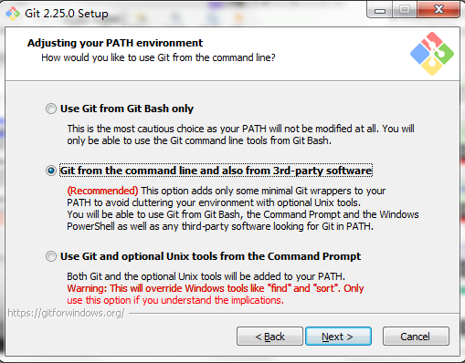  
&emsp;&emsp;这里是选择调整你的PATH环境变量，这里推荐使用`Use Git from Git Bash only`选项（完全不修改环境变量），然后点击Next  
&emsp;&emsp;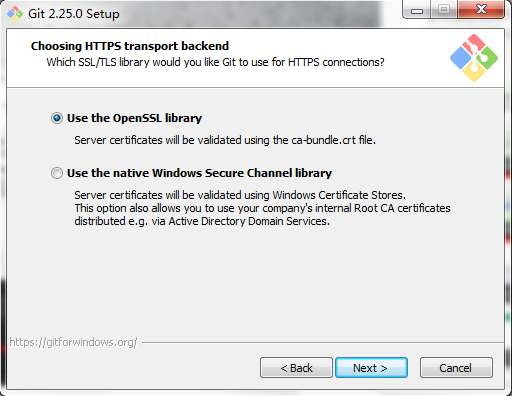  
&emsp;&emsp;这里是选择你的本地库与远程库的连接方式，这里推荐使用默认选项就可以，然后点击Next  
&emsp;&emsp;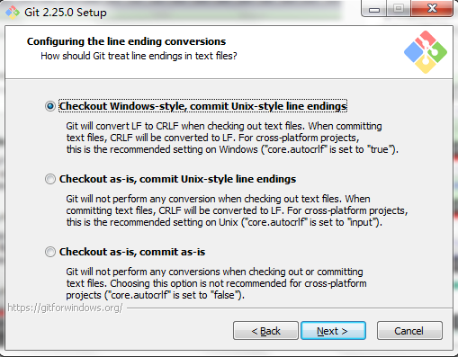  
&emsp;&emsp;这里是选择关于换行符的处理方式，这里选择默认值就可以，然后点击Next  
&emsp;&emsp;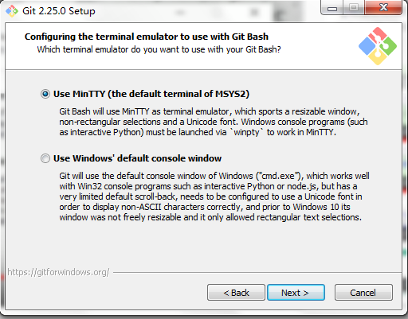  
&emsp;&emsp;这里是选择执行git命令终端，这里推荐使用默认选项，然后点击Next  
&emsp;&emsp;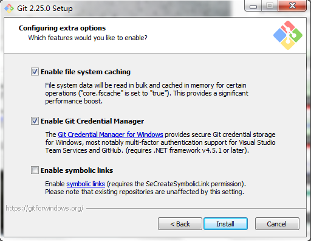  
&emsp;&emsp;这里推荐使用默认选项，然后点击Install，进行安装。  
&emsp;&emsp;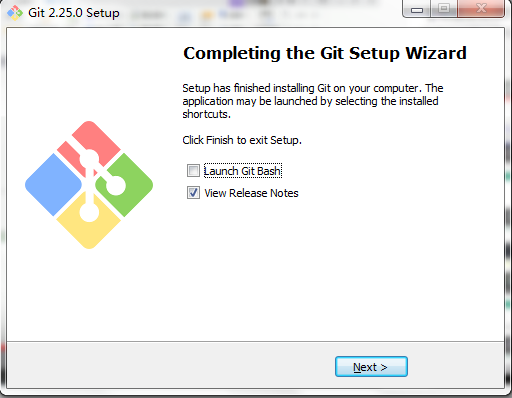  
&emsp;&emsp;点击Next，安装完成！  
## **1.2Linux下Git的安装(暂无)**  
## **1.3Mac下Git的安装(暂无)**  

[返回Git的目录](../README.md)  
[上一章:0.Git和代码托管中心的简介](0.Git和代码托管中心的简介.md)  
[下一章:2.Git的命令行操作](2.Git的命令行操作.md)  