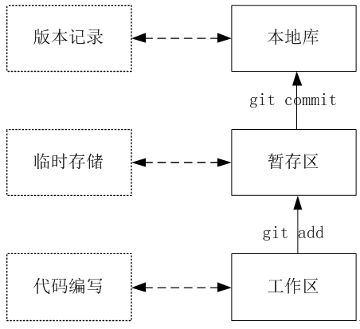
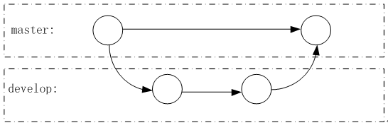

# 2.Git的命令行操作  
## 2.1 本地库操作  
1. 本地初始化
   - 命令:
     - `git init`
   - 效果:
     - 会在当前本地库下创建一个`.git`的隐藏目录。
   - 注意:
     - `.git`目录中存放的是本地库相关的子目录和文件，不要删除，也不要随意修改。
2. 设置签名
   - 形式:
     - 用户名:`xxx`
     - Email地址:`xxx@xxx.com`
   - 作用:
     - 区分不同开发人员的身份
   - 辨析:
     - 此处设置的签名和登入远程库(代码托管中心)的账号、密码没有任何关系
   - 命令:
     - 项目级别(仓库级别):仅在当前本地库范围有效
       - `git config user.name xxx`
       - `git config user.email xxx@xxx.com`
       - 信息保存位置:`./.git/config`文件
     - 系统用户级别:登入当前操作系统的用户范围
       - `git config --global user.name xxx`
       - `git config --global user.email xxx@xxx.com`
       - 信息保存位置:`~/.gitconfig`文件
   - 级别优先级: 
     - 就近原则:项目级别优先于系统用户级别，二者都有时采用项目级别的签名
     - 如果只有系统用户级别的签名，就以系统用户级别的签名为准
     - 二者都没有不允许
3. 基本操作  
&emsp;&emsp;  
   - 状态查看操作
     - 命令:
       - `git status`
     - 效果:
       - 查看工作区、暂存区状态
   - 添加操作
     - 命令:
       - `git add filename`
     - 效果:
       - 将工作区的‘新建或者修改’添加到暂存区
   - 提交操作
     - 命令:
       - `git commit filename -m "提交信息"`
     - 效果:
       - 将暂存区的内容提交到本地库
   - 查看历史记录
     - 命令1:
       - `git log`
     - 效果:
       - 显示详细的提交信息
     - 多屏显示控制方式:
       - 空格向下翻页，b键向上翻页，q键退出
     - 命令2:
       - `git log --pretty=oneline`
     - 效果:
       - 将提交信息显示为一行
     - 命令3:
       - `git log --oneline`
     - 效果:
       - 将提交信息显示为一行(索引值只显示前7位)
     - 命令:
       - `git reflog`
     - 效果:
       - HEAD@{移动到当前版本需要多少步}
   - 版本前进后退
     - 基于索引值操作[推荐]
       - 命令:
         - `git reset --hard 索引值前7位`
     - 基于`^`符号
       - 注意:
         - 只能后退
       - 命令:
         - `git reset --hard HEAD^`(回退几步写几个`^`符号)
     - 基于`~`符号
       - 注意:
         - 只能后退
       - 命令:
         - `git reset --hard HEAD~n`(回退几步`n`就等于几)
     - `reset`命令三个参数对比
       - `--soft`参数:仅仅是在本地库移动`HEAD`指针
       - `--mixed`参数:在本地库移动`HEAD`指针，并重置暂存区
       - `--hard`参数[主要使用]:在本地库移动`HEAD`指针，并重置暂存区和工作区
   - 删除文件并找回
     - 前提:
       - 删除前，文件存在时的状态提交到了本地库
     - 命令:
       - `git reset --hard 指针位置`
     - 注意:
       - 删除操作已经提交到本地库:指针位置指向历史记录
       - 删除操作尚未提交到本地库:指针位置使用HEAD
   - 比较文件差异
     - 命令1:
       - `git diff filename`
     - 效果:
       - 将工作区中的文件和暂存区进行比较
     - 命令2:
       - `git diff 本地库中历史版本 filename`
     - 效果:
       - 将工作区中的文件和本地库历史记录进行比较
4. 分支管理
   - 什么是分支
     - 在版本控制过程中，使用多条线同时推进多个任务  

   - 分支的优势
     - 同时并行推进多个功能的开发，提高开发效率
     - 各个分支在开发过程中，如果某一个分支开发失败，不会对其他分支有任何影响，失败的分支删除重新开始即可。
   - 分支的操作
     - 创建分支
       - 命令:
         - `git branch branchname`
     - 查看分支
       - 命令:
         - `git branch -v`
     - 切换分支
       - 命令:
         - `git checkout branchname`
     - 合并分支
       - 切换到接受修改的分支上(被合并，增加新内容)上
       - &emsp;&emsp;执行`merge`命令
       - 命令:
         - `git merge branchname`
     - 解决冲突
       - 编辑文件，删除特殊符号
       - 把文件修改到满意的程度，保存退出
       - `git add filename`
       - `git commit -m "message"`(注意:此时`commit`一定不能带具体的文件名)
## 2.2 远程库操作  
1. 注册Github账号
   - 进入Github的[官网](https://github.com/)，然后点击Sign Up，创建一个Github的账号。
2. 创建远程库
   - 登入Github的[官网](https://github.com/)，然后点击右上角的`+`号按钮，选择`New repository`，在`Repository name`处输入代码库名，然后点击`Creat repository`创建远程库。
3. 创建远程库地址别名
   - 前提:
     - `cd 本地库`
   - 命令:
     - `git remote add origin 远程库地址`
   - 注意:
     - 可用`git remote -v`查看所有已添加的地址别名
4. 推送
   - 命令:
     - `git push origin 分支名`
5. 克隆
   - 命令:
     - `git clone 远程库地址`
   - 效果:
     - 完整的把远程库下载到本地
     - 创建origin远程库别名
     - 初始化本地库
6. 团队成员邀请
   - 进入Github的[官网](https://github.com/)，选择相应的项目，`Setting`->`Manage access`->`Invite a collaborator`->输入待邀请人员的账号->点击`Select a collaborator above`->复制邀请链接->发送给对应人员->待邀请人点击链接加入项目组
7. 拉取
   - 命令:
     - `git pull 远程库地址别名 远程库分支名`
   - 注意:
     - `pull` = `fetch` + `merge`
     - `git fetch 远程库地址别名 远程库分支名`
     - `git merge 远程库地址别名/远程库分支名`
8. 解决冲突
   - 要点:
     - 如果不是基于Github远程库的最新版所做的修改，不能推送，必须先拉取。
     - 拉取下来后如果进入冲突状态，则按照“分支冲突解决”操作解决即可。
9. 跨团队合作
   - 团队外的人:
     - 进入Github的[官网](https://github.com/)，去相应的项目目录下，点击`fork`按键
     - `clone`至本地，在本地修改并提交，然后推送至远程库。
     - 进入Github的[官网](https://github.com/)，在自己目录下点击`Pull request`->`New pull request`->填入相关信息->`Creat pull request`
   - 团队内的人:
     - 进入Github的[官网](https://github.com/)，去相应的项目目录下，点击`Pull request`按键
     - 审核代码
     - 合并代码，点击`Merge pull request`，填入合并信息，点击`Confirm merge`
     - 将远程库代码拉取到本地

[返回Git的目录](../README.md)  
[上一章:1.Git的安装](1.Git的安装.md)  
[下一章:3.Git的图形化操作](3.Git的图形化操作.md)  
