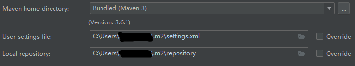

# **Maven笔记**  
## **1.Maven是什么**  
&emsp;&emsp;Maven是一款服务于Java平台的自动化构建工具。  
## **2.构建是什么**  
&emsp;&emsp;1.概念：以”Java源文件“、”框架配置文件“、”JSP“、”HTML“、”图片“等资源为”原材料“，去“生产”一个可运行的项目的过程。  
&emsp;&emsp;2.编译：Java源文件[.java]->编译->Class字节码文件[.class]->JVM执行  
&emsp;&emsp;3.部署：一个BS项目最终运行的并不是动态Web本身，而是这个动态Web工程“编译的结构”。  
## **3.构建过程的各个环节**  
&emsp;&emsp;1.清理：将以前编译得到的旧的class字节码文件删除，为了下一次编译做准备  
&emsp;&emsp;2.编译：将Java源程序编译成class字节码文件  
&emsp;&emsp;3.测试：自动测试，自动调用Junit程序  
&emsp;&emsp;4.报告：测试程序执行的结果  
&emsp;&emsp;5.打包：动态Web程序打war包，java工程打jar包  
&emsp;&emsp;6.安装：Maven特定的概念--将打包得到的文件复制到“仓库”中的指定位置  
&emsp;&emsp;7.部署：将动态Web工程生成的war包复制到Servlet容器的指定目录下，使其可以运行  
## **4.安装Maven核心程序**  
&emsp;&emsp;1.检查JAVA_HOME环境变量  
&emsp;&emsp;2.解压Maven核心程序的压缩包，放在一个非中文无空格路径下  
&emsp;&emsp;3.配置Maven相关的环境变量(MAVEN_HOME，PATH)  
&emsp;&emsp;4.验证运行`mvn -v`查看Maven版本  
## **5.Maven的核心概念**  
&emsp;&emsp;1.约定的目录结构  
&emsp;&emsp;2.POM  
&emsp;&emsp;3.坐标  
&emsp;&emsp;4.依赖  
&emsp;&emsp;5.仓库  
&emsp;&emsp;6.生命周期/插件/目标  
&emsp;&emsp;7.继承  
&emsp;&emsp;8.聚合  
## **6.常用命令**  
&emsp;&emsp;1.`mvn clean`:清理  
&emsp;&emsp;2.`mvn compile`:编译主程序  
&emsp;&emsp;3.`mvn test-compile`:编译测试程序  
&emsp;&emsp;4.`mvn test`:执行测试  
&emsp;&emsp;5.`mvn package`:打包  
&emsp;&emsp;6.`mvn install`:安装  
&emsp;&emsp;7.`mvn sit`:生成站点  
## **7.关于联网问题**  
&emsp;&emsp;1.Maven 的核心程序中仅仅定义了抽象的生命周期，但是具体的工作必须有特定的插件来完成。而插件本身不包含在Maven核心程序中。  
&emsp;&emsp;2.当我们执行的Maven命令需要用到某些插件时，Maven核心程序会首先到本地仓库中查找。  
&emsp;&emsp;3.本地仓库的默认位置：`~\.m2\repository`  
&emsp;&emsp;4.Maven核心程序如果在本地仓库中找不到需要的插件，那么它会自动连接外网，到中央仓库下载。  
&emsp;&emsp;5.如果此时无法连接外网，则构建失败。  
&emsp;&emsp;6.修改默认本地仓库的位置可以让Maven核心程序到我们事先准备好的目录下查找插件  
&emsp;&emsp;&emsp;&emsp;步骤1：找到Maven解压目录\conf\settings.xml  
&emsp;&emsp;&emsp;&emsp;步骤2：在setting.xml 文件中找到 localRepository 标签  
&emsp;&emsp;&emsp;&emsp;步骤3：将 < localRepository>/path/to/local/repo< /localRepository>从注释中取出  
&emsp;&emsp;&emsp;&emsp;步骤4：将标签体内容修改为自定义的Maven仓库目录   
## **8.POM**  
&emsp;&emsp;1.含义：Project Object Model(项目对象模型)  
&emsp;&emsp;2.pom.xml 对于 Maven工程是核心配置文件，与构建过程相关的一切设置都在这个文件中进行配置。  
## **9.坐标**  
&emsp;&emsp;1.数学中的坐标：  
&emsp;&emsp;&emsp;&emsp;在平面中，使用X,Y坐标可以唯一的定位平面中的任何一个点。  
&emsp;&emsp;&emsp;&emsp;在空间中，使用X,Y,Z三个向量可以唯一的定位空间中的任何一个点。  
&emsp;&emsp;2.Maven的坐标：  
&emsp;&emsp;&emsp;&emsp;使用下面三个向量在仓库中唯一定位一个Maven工程  
&emsp;&emsp;&emsp;&emsp;`groupid`:公司或组织域名倒序+项目名  
&emsp;&emsp;&emsp;&emsp;`<groupid>com.atguigu.maven</groupid>`  
&emsp;&emsp;&emsp;&emsp;`artifactid`:模块名  
&emsp;&emsp;&emsp;&emsp;`<artifactid>Hello</artifactid>`  
&emsp;&emsp;&emsp;&emsp;`version`:版本  
&emsp;&emsp;&emsp;&emsp;`<version>1.0.0</version>`  
&emsp;&emsp;3.Maven 工程的坐标与仓库中路径的对应关系，以spring为例
```
<groupId>org.springframework</groupId>
<artifactId>spring-core</artifactId>
<version>4.0.0.RELEASE</version>
```
对应位置：`org/springframework/spring-core/4.0.0.RELEASE/spring-core-4.0.0.RELEASE.jar`  
## **10.仓库**  
&emsp;&emsp;1.仓库的分类  
&emsp;&emsp;&emsp;&emsp;本地仓库：当前电脑上部署的仓库目录，为当前电脑上所有Maven工程服务  
&emsp;&emsp;&emsp;&emsp;远程仓库：  
&emsp;&emsp;&emsp;&emsp;&emsp;&emsp;私服：搭建在局域网环境中，为局域网范围内的所有Maven工程服务  
&emsp;&emsp;&emsp;&emsp;&emsp;&emsp;中央仓库：架设在Internet上，为全世界所有Maven工程服务  
&emsp;&emsp;&emsp;&emsp;&emsp;&emsp;中央仓库镜像：为了分担中央仓库流量，提升用户访问速度  
&emsp;&emsp;2.仓库保存的内容：Maven工程  
&emsp;&emsp;&emsp;&emsp;Maven自身所需要的插件  
&emsp;&emsp;&emsp;&emsp;第三方框架或工具的jar包  
&emsp;&emsp;&emsp;&emsp;我们自己开发的Maven工程  
## **11.依赖**  
&emsp;&emsp;1.Maven解析依赖信息时会到本地仓库中查找被依赖的jar包  
&emsp;&emsp;对于我们自己开发的Maven工程，要使用`mvn install`命令安装后就可以打包放入仓库。  
&emsp;&emsp;2.依赖的范围  
&emsp;&emsp;&emsp;&emsp;compile范围依赖:  
&emsp;&emsp;&emsp;&emsp;&emsp;&emsp;对主程序是否有效：有效  
&emsp;&emsp;&emsp;&emsp;&emsp;&emsp;对测试程序是否有效：有效  
&emsp;&emsp;&emsp;&emsp;&emsp;&emsp;是否参与打包：参与  
&emsp;&emsp;&emsp;&emsp;&emsp;&emsp;是否参与部署：参与  
&emsp;&emsp;&emsp;&emsp;&emsp;&emsp;典型例子：spring-core.jar  
&emsp;&emsp;&emsp;&emsp;test范围依赖:  
&emsp;&emsp;&emsp;&emsp;&emsp;&emsp;对主程序是否有效：无效  
&emsp;&emsp;&emsp;&emsp;&emsp;&emsp;对测试程序是否有效：有效  
&emsp;&emsp;&emsp;&emsp;&emsp;&emsp;是否参与打包：不参与  
&emsp;&emsp;&emsp;&emsp;&emsp;&emsp;是否参与部署：不参与  
&emsp;&emsp;&emsp;&emsp;&emsp;&emsp;典型例子：junit.jar  
&emsp;&emsp;&emsp;&emsp;provided范围依赖:  
&emsp;&emsp;&emsp;&emsp;&emsp;&emsp;对主程序是否有效：有效  
&emsp;&emsp;&emsp;&emsp;&emsp;&emsp;对测试程序是否有效：有效  
&emsp;&emsp;&emsp;&emsp;&emsp;&emsp;是否参与打包：不参与  
&emsp;&emsp;&emsp;&emsp;&emsp;&emsp;是否参与部署：不参与  
&emsp;&emsp;&emsp;&emsp;&emsp;&emsp;典型例子：servlet-api.jar  
&emsp;&emsp;3.依赖的传递性  
&emsp;&emsp;&emsp;&emsp;好处：可以传递的依赖不必在每个模块工程中都重复声明，在“最下面”的工程中依赖一次即可。  
&emsp;&emsp;&emsp;&emsp;注意：非compile范围的依赖不能传递。所以在各个工程模块中，如果需要就得重复声明依赖。  
&emsp;&emsp;4.依赖的排除  
&emsp;&emsp;&emsp;&emsp;设置需要依赖排除的场合：存在不稳定的jar包，不希望加入当前的工程  
&emsp;&emsp;&emsp;&emsp;依赖排除的设置方式：  
```
<exclusions>
    <exclusion>
        <groupId></groupId>
        <artifactId></artifactId>
    </exclusion>
</exclusions>
```
&emsp;&emsp;5.依赖的原则  
&emsp;&emsp;&emsp;&emsp;作用：解决模块工程之间的jar包冲突问题  
&emsp;&emsp;&emsp;&emsp;原则：路径最短者优先，路径相同时先声明者优先（现声明是指dependency标签的声明顺序）  
&emsp;&emsp;6.统一管理依赖的版本  
&emsp;&emsp;&emsp;&emsp;使用properties标签内使用自定义统一声明版本号  
```
<properties>
    <log4j.version>1.2.12</log4j.version>
</properties>
```
&emsp;&emsp;&emsp;&emsp;在需要统一版本的位置，使用`${自定义标签名}`引用声明的版本号  
```
<dependency>
    <groupId>log4j</groupId>
    <artifactId>log4j</artifactId>
    <version>${log4j.version}</version>
</dependency>
```
&emsp;&emsp;&emsp;&emsp;其实properties标签配合自定义标签声明数据的配置并不是只能用于声明依赖的版本号。凡是需要统一声明后再引用的场合都可以使用。  
## **12.生命周期**  
&emsp;&emsp;1.各个构建环节执行的顺序：不能打乱顺序，必须按照既定的正确顺序来执行。  
&emsp;&emsp;2.Maven的核心程序中定义了抽象的生命周期，生命周期中各个阶段的具体任务是有插件来完成的。  
&emsp;&emsp;3.Maven核心程序为了更好的实现自动化构建，按照这样的特点执行生命周期中各个阶段：不论现在要执行生命周期中的哪一阶段，都是从这个生命周期最初的位置开始执行。  
&emsp;&emsp;4.插件和目标  
&emsp;&emsp;&emsp;&emsp;生命周期的各个阶段仅仅定义了要执行的任务是什么。  
&emsp;&emsp;&emsp;&emsp;各个阶段和插件的目标是对应的。  
&emsp;&emsp;&emsp;&emsp;相似的的目标有特定的插件来完成。  
&emsp;&emsp;&emsp;&emsp;可以将目标看作“调用插件功能的命令”。  
## **13.IDEA中使用Maven**  
&emsp;&emsp;1.Maven插件IDEA已经内置。  
&emsp;&emsp;2.Maven插件的设置：`File`->`Settings`->搜索Maven  
&emsp;&emsp;  
&emsp;&emsp;&emsp;&emsp;Maven home directory:是指Maven的主目录，建议改为自己安装的。  
&emsp;&emsp;&emsp;&emsp;User settings file:指定Maven核心程序中 conf/settings.xml 文件的位置。  
&emsp;&emsp;&emsp;&emsp;Local repository:本地仓库目录。  
&emsp;&emsp;3.基本操作  
&emsp;&emsp;&emsp;&emsp;创建Maven版工程，`File`->`New`->`Project`->选择Maven->输入工程名Name->选择本地路径->输入GroupId、ArtifactId、Version->`Finish`  
&emsp;&emsp;&emsp;&emsp;执行Maven命令  
## **14.继承**  
&emsp;&emsp;问题：由于test范围的依赖不能传递，所以必然会分散在各个模块工程中，很容易造成版本不一致。  
&emsp;&emsp;需求：统一管理各个模块工程中依赖的版本  
&emsp;&emsp;方案：将依赖版本统一提取到“父”工程中，在子工程中声明依赖时不指定版本，以“父”工程中统一设定的为准。同时也便于修改  
&emsp;&emsp;创建步骤：  
&emsp;&emsp;&emsp;&emsp;创建一个Maven工程作为父工程。注意：打包的方式pom  
```
<groupId>org.example</groupId>
<artifactId>father</artifactId>
<version>1.0-SNAPSHOT</version>
<packaging>pom</packaging>
```
&emsp;&emsp;&emsp;&emsp;在子工程中声明对父工程的引用  
```
<parent>
    <artifactId>father</artifactId>
    <groupId>org.example</groupId>
    <version>1.0-SNAPSHOT</version>
<!--以当前pom.xml文件基准的父工程pom.xml的相对路径-->
    <relativePath>../pom.xml</relativePath>
</parent>
```
&emsp;&emsp;&emsp;&emsp;将子工程的坐标中与父工程坐标中重复的内容删除  
&emsp;&emsp;&emsp;&emsp;在父工程中统一管理依赖  
```
<dependencyManagement>
    <dependencies>
        <dependency>
            <groupId>junit</groupId>
            <artifactId>junit</artifactId>
            <version>4.12</version>
            <scope>test</scope>
        </dependency>
    </dependencies>
</dependencyManagement>
```
&emsp;&emsp;&emsp;&emsp;在子工程中删除相应依赖的版本号部分  
&emsp;&emsp;注意：配置继承后，执行安装命令时要先安装父工程。  
## **15.聚合**  
&emsp;&emsp;作用：一键安装各个模块工程  
&emsp;&emsp;配置方式：在一个“总的聚合工程”中配置各个参与聚合的模块  
```
<modules>
    <!--指定各个子工程的相对路径-->
    <module>son</module>
</modules>
```
&emsp;&emsp;使用方式：在聚合工程，使用`maven install`命令  